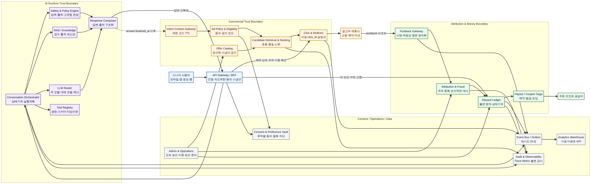
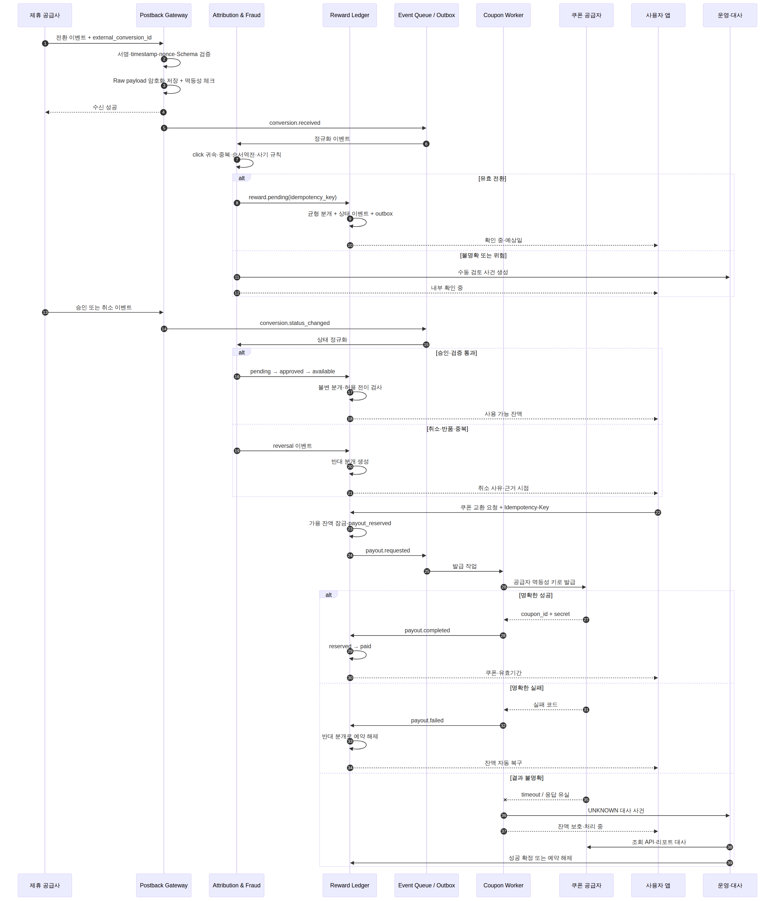
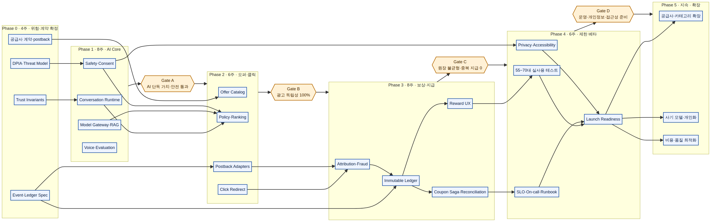

# 시니어 보상형 AI 플랫폼 시스템 개발 기획안

**프로젝트 가칭:** 혜택AI(브랜드 후보: 모아·아루·보니 등)  
**문서 성격:** 제품 요구사항과 실제 구현 사이를 연결하는 시스템 개발 기준서  
**주요 독자:** 창업자, CTO, Tech Lead, Backend·AI·Mobile·Data·Security·QA·운영 책임자  
**문서 상태:** MVP 개발 착수용 기준안 v1.0  
**작성:** Manus AI  
**기준 시점:** 2026년 7월  
**관련 UX·사업 기획:** `final_report.md`, `ux_service_plan.md`, `product_business_model.md`

---

## Executive Summary

본 기획안은 시니어 사용자가 생활 질문을 해결하고, 답변과 분리된 혜택을 선택하며, 실제 전환이 검증된 뒤 보상을 받는 서비스를 **프로덕션 수준으로 구현하기 위한 기준 문서**다. 핵심 차별점은 LLM이 광고 수익을 보고 답변을 왜곡할 수 없게 아키텍처로 차단하고, 클릭·전환·보상을 멱등 이벤트와 불변 원장으로 관리하며, 동의·개인정보·운영자 행위를 사후 설명 가능한 상태로 남긴다는 데 있다.

MVP는 자체 기초모델을 학습하지 않는다. 외부 상용 LLM 1~2개, 공급자 중립 Model Gateway, 검수된 RAG, 명시적 Safety Policy, 평가셋을 조합한다. 제품 코드는 모듈러 모놀리스로 빠르게 구축하되 **AI Runtime, Commercial, Attribution, Reward Ledger**는 데이터와 권한 경계를 처음부터 분리한다. 광고 장애는 답변을 실패시킬 수 없고, 공급사·쿠폰사 장애는 보상 소실이나 중복 지급으로 이어질 수 없다.

| 경영 의사결정 | 최종 권고 |
| --- | --- |
| 무엇을 먼저 만드는가 | 광고 없는 AI Core와 평가·동의 기반을 먼저 완성한 뒤 오퍼, 귀속, 원장 순으로 확장한다. |
| 무엇을 자체화하는가 | 답변 정책, 광고 독립성, 의도 Gateway, 오퍼 품질, 귀속, 원장, 대사, 운영 증거는 자체 핵심 자산으로 둔다. |
| 무엇을 외부 구매하는가 | Foundation Model, 음성 인식·합성, 쿠폰 발급, 일부 광고 네트워크와 관리형 인프라는 교체 가능한 Adapter로 구매한다. |
| 무엇이 출시를 막는가 | 원장 불균형, 중복 지급, 광고 독립성 위반, 고위험 광고 노출, 동의 철회 실패, 핵심 접근성 실패는 즉시 출시 차단이다. |
| 첫 32주의 목표 | 계약·위험 4주, AI Core 8주, 오퍼·클릭 6주, 원장·지급 8주, 제한 베타·운영화 6주를 기준으로 한다. |
| 성공을 무엇으로 판단하는가 | CTR이 아니라 성공 과업, 근거 정확성, 광고 식별, 보상 정합성, 문의율, 철회 처리, 성공 과업당 비용으로 판단한다. |

> **최상위 설계 결론:** 이 제품은 “광고가 붙은 챗봇”이 아니라 **신뢰 가능한 AI, 제한된 상업화 결정, 전환 귀속, 금융 수준 보상 원장을 결합한 플랫폼**으로 개발해야 한다.

### 문서 내비게이션

| 필요한 결정 | 우선 확인할 장 |
| --- | --- |
| 시스템 경계·기술 스택 | 1~4장 |
| LLM·RAG·에이전트·평가 | 5~10장 |
| 오퍼·광고·클릭·전환 | 11~14장 |
| 보상 원장·쿠폰 지급 | 15~16장 |
| 데이터·API | 17장 |
| 개인정보·보안·운영 | 18~20장 |
| 인프라·SLO·배포·QA | 21~24장 |
| 조직·로드맵·비용 | 25~27장 |
| 출시 승인 기준 | 28장 |

## 0. 문서의 역할과 의사결정 범위

이 문서는 단순한 기술 스택 추천서가 아니다. 사용자가 AI로 생활 문제를 해결하고, AI 답변과 분리된 제휴 혜택을 자발적으로 선택하며, 외부 전환이 확인된 뒤 보상을 받기까지의 전 과정을 **실제로 개발·시험·운영할 수 있는 시스템 명세**로 정의한다. 특히 LLM 품질뿐 아니라 광고 독립성, 개인정보 목적 제한, 전환 귀속, 보상 정합성, 운영자 통제와 장애 복구를 하나의 아키텍처 안에서 다룬다.

이 문서는 다음 결정을 고정한다.

| 결정 영역 | 본 문서의 기준 결정 |
| --- | --- |
| 초기 모델 전략 | 자체 기초모델 사전학습 없이 외부 상용 LLM 1~2개와 RAG를 사용한다. |
| 시스템 구조 | MVP는 모듈러 모놀리스로 빠르게 구축하되, LLM 실행·광고 결정·전환 귀속·보상 원장은 독립 데이터 소유권과 인터페이스를 가진다. |
| 광고 독립성 | 기본 답변 생성 경로는 광고 후보, 수수료, 전환율, 캠페인 예산을 조회할 수 없다. 답변 확정 후 제한된 의도 코드만 광고 서비스에 전달한다. |
| 보상 기준 | 대화 횟수나 체류시간이 아니라 검증된 구매·예약·미션 전환에서 발생한 확정 수익을 기준으로 한다. |
| 진실의 원천 | 대화는 Conversation Store, 동의는 Consent Ledger, 전환은 Attribution Store, 금액은 Reward Ledger가 각각 진실의 원천이다. 캐시와 분석 저장소는 원장을 대체하지 않는다. |
| 사용자 보호 | 고위험 의도에는 광고를 노출하지 않으며 결제·신청·연락처 제공은 자동 실행하지 않는다. |
| 운영 모델 | 초기에는 오퍼 승인, 전환 대사, 예외 보상과 개인정보 요청을 운영자가 검수하는 Human-in-the-loop 방식으로 시작한다. |

### 0.1 MVP에서 의도적으로 하지 않는 것

초기 버전은 범위를 넓히는 대신 불변조건을 정확히 검증한다. 자동 구매·결제, 현금 출금, 장기 개인 기억, 대화 원문 기반 광고 프로필, 고위험 금융·의료·도박 오퍼, 무검수 오퍼 자동 게시, 전환 승인 전 무제한 선지급, 자체 기초모델 학습은 MVP에서 제외한다.

> **개발 성공의 정의:** “챗봇이 답한다”가 아니라, **답변이 광고와 독립적으로 생성되고, 오퍼 노출 이유를 설명할 수 있으며, 외부 전환과 사용자 보상이 한 건도 잃어버리거나 중복 지급되지 않고, 사용자가 자신의 데이터 이용을 통제할 수 있는 상태**다.

---

## 1. 시스템 미션과 최상위 개발 원칙

### 1.1 시스템 미션

혜택AI 시스템의 미션은 55~70대 사용자가 음성 또는 텍스트로 생활 문제를 쉽게 해결하고, 필요할 때만 검수된 혜택을 이해한 뒤 선택하며, 전환 수익의 일부를 투명하게 돌려받도록 만드는 것이다. 시스템은 AI 서비스, 광고 플랫폼, 거래 원장, 개인정보 플랫폼의 성격을 동시에 가지므로 각 영역의 실패가 다른 영역으로 전파되지 않도록 경계를 명확히 해야 한다.

### 1.2 비타협 원칙

| 원칙 | 시스템으로 강제하는 방식 | 금지 사례 |
| --- | --- | --- |
| **Answer First** | 답변 객체를 먼저 확정하고 해시·추적 ID를 기록한 뒤 오퍼 요청을 시작한다. | 광고 단가를 보고 답변 문구나 추천 순서를 변경 |
| **No Ad Is Valid** | 적합성과 품질 기준을 통과한 후보가 없으면 `ad_card: null`을 정상 응답으로 처리한다. | 빈 재고를 저품질 오퍼로 채움 |
| **Explicit Consent** | 목적·버전·시점별 동의를 서버에서 판정하고 UI 표시와 외부 전송에 함께 적용한다. | 포괄 동의 하나로 대화 저장·광고·제3자 제공 처리 |
| **Least Data** | 광고 서비스에는 대화 원문 대신 제한된 의도 코드·가격대·지역 범위만 전달한다. | 건강·금융·가족관계 등 민감 신호를 광고 프로필에 축적 |
| **Money Is a Ledger** | 금액 변화는 불변 원장 이벤트와 균형 분개로만 생성한다. 운영자가 잔액 컬럼을 직접 수정할 수 없다. | 관리자 화면에서 잔액 숫자 덮어쓰기 |
| **Idempotency Everywhere** | 클릭·postback·원장·쿠폰 발급에 멱등성 키와 유일 제약을 적용한다. | 재시도 때 중복 적립 또는 중복 쿠폰 발급 |
| **Explain Every Decision** | 모델·프롬프트·출처·정책·오퍼 필터·랭킹 특징·동의 판정을 추적 ID로 재현한다. | “AI가 결정했다”만 남기고 근거 미보존 |
| **Human Override with Audit** | 금액·동의·오퍼 정책 변경은 역할 분리, 이중 승인, 사유와 전후값을 기록한다. | 한 운영자가 고액 보상 조정 후 기록 삭제 |
| **Accessible by Default** | 큰 글씨, 음성 확인, 오류 복구, 상태의 텍스트 표시를 API·클라이언트 계약에 포함한다. | 색상만으로 보상 상태 전달 |
| **Safe Degradation** | 외부 LLM·광고사·쿠폰사 장애를 분리하고 기본 AI 또는 조회 기능을 가능한 범위에서 유지한다. | 광고사 장애가 AI 답변 전체 장애로 확산 |

### 1.3 핵심 불변조건

다음 조건은 기능 요구가 바뀌어도 깨지면 안 되는 시스템 불변조건이다.

1. `answer.finalized_at` 이전에는 오퍼 후보 조회가 발생하지 않는다.
2. `commercial_intent`가 고위험·민감 정책에 해당하면 오퍼 결과는 항상 비어 있어야 한다.
3. 개인화 광고 동의가 없으면 장기 선호 태그를 조회하지 않고 현재 세션의 비민감 문맥만 사용하거나 오퍼를 미노출한다.
4. 외부 이동 전에는 유효한 `click_id`와 화면에 표시된 오퍼 조건의 `offer_snapshot_id`가 함께 생성되어야 한다.
5. 동일 공급사의 동일 `external_conversion_id`는 한 번만 경제적 효과를 만든다.
6. `available` 보상은 승인된 공급사 수익과 내부 정책을 모두 통과해야 한다.
7. 원장 분개 합계는 거래별·통화별로 항상 0이어야 하며, 삭제나 수정 대신 반대 분개로 정정한다.
8. 쿠폰 발급 실패는 사용자 가용 잔액 손실로 끝나지 않아야 한다.
9. 동의 철회는 새 요청부터 즉시 적용되며, 비동기 삭제가 남아 있어도 목적 외 신규 처리를 차단한다.
10. 운영·분석 로그에는 인증 토큰, 연락처 원문, 대화 속 민감정보, 외부 LLM 비밀키가 기록되지 않는다.

---

## 2. 품질속성, SLI·SLO·SLA

### 2.1 품질속성 우선순위

혜택AI에서 모든 품질속성이 동일한 우선순위를 갖지는 않는다. 돈과 동의를 다루는 경로는 속도보다 정합성이 우선이고, 대화 경로는 완전한 강한 일관성보다 낮은 지연시간과 복구 가능성이 중요하다.

| 우선순위 | 품질속성 | 설계 해석 |
| ---: | --- | --- |
| 1 | 금액 정합성·멱등성 | 보상 중복·소실 0을 목표로 강한 트랜잭션, 유일 제약, 대사와 보상 절차를 적용한다. |
| 2 | 개인정보 목적 제한·보안 | 물리·논리 데이터 분리, 최소권한, 목적별 동의 판정, 필드 암호화를 우선한다. |
| 3 | 사용자 안전·광고 독립성 | 고위험 광고 차단, 답변 선확정, 설명 가능성과 운영 감사가 필요하다. |
| 4 | 가용성·복구성 | 외부 공급자 장애를 격리하고 큐·재시도·대체 모델로 복구한다. |
| 5 | 응답 지연시간 | 스트리밍, 병렬 RAG, 모델 라우팅과 캐시로 체감 속도를 개선한다. |
| 6 | 비용 효율 | 토큰 예산과 모델 등급, 캐시, 비동기 후처리로 단위비용을 통제한다. |
| 7 | 개발 속도 | 모듈러 모놀리스와 관리형 서비스를 사용하되 핵심 경계는 희생하지 않는다. |

### 2.2 초기 서비스 수준 목표

MVP는 법적 계약 수준의 SLA를 외부에 약속하기보다 내부 SLO로 운영하고, 파일럿 데이터가 쌓인 뒤 유료 제휴 계약의 SLA로 전환한다. 아래 값은 출시 전 성능시험과 실제 공급사 응답시간을 통해 조정할 목표값이다.

| 경로 | SLI | MVP SLO | 확장 SLO | 실패 처리 |
| --- | --- | ---: | ---: | --- |
| 인증·설정 조회 | p95 응답시간 | 300ms 이하 | 200ms 이하 | 읽기 캐시, 마지막 정상 설정 사용 |
| 텍스트 답변 | 최초 토큰 p95 | 2.5초 이하 | 1.5초 이하 | 1회 제한 재시도 후 대체 모델 |
| 텍스트 답변 | 전체 완료 p95 | 12초 이하 | 8초 이하 | 질문 보존, 비동기 재시도 안내 |
| 음성 인식 | 중간 결과 p95 | 1.5초 이하 | 1.0초 이하 | 원문 확인·수정 경로 제공 |
| 오퍼 카드 | 답변 완료 후 p95 | 500ms 이하 | 300ms 이하 | 타임아웃 시 미노출; 답변은 유지 |
| 외부 이동 링크 | 생성 성공률 | 99.9% 이상 | 99.95% 이상 | 링크 생성 실패 시 이동 차단 |
| postback 수신 | API 가용성 | 99.95% 이상 | 99.99% 이상 | 큐 적재, DLQ, 공급사 재전송 |
| 전환 반영 | 수신→`pending` p99 | 60초 이내 | 10초 이내 | 지연 경보, 재처리 |
| 보상 조회 | p95 응답시간 | 500ms 이하 | 300ms 이하 | 원장 읽기 모델 재생성 |
| 쿠폰 교환 | 요청 확정 p95 | 3초 이하 | 2초 이하 | `processing` 표시 후 Saga 복구 |
| 동의 변경 | 정책 반영 | 즉시·5초 이내 | 즉시·2초 이내 | 서버 캐시 무효화, 실패 시 보수적 거부 |
| 데이터 삭제 | 처리 완료 | 정책별 기한 내 | 자동화율 95% 이상 | 보존 예외와 남은 작업 표시 |

### 2.3 정합성 등급

| 데이터 | 일관성 모델 | 허용되지 않는 상태 |
| --- | --- | --- |
| 보상 원장·쿠폰 차감 | PostgreSQL 직렬화 가능한 트랜잭션 또는 충돌 감지 + 균형 분개 | 음수 가용 잔액, 중복 지급, 불균형 분개 |
| 동의 판정 | 강한 읽기 또는 짧은 TTL + 철회 즉시 무효화 | 철회 뒤 신규 개인화·전송 |
| 클릭·전환 귀속 | 최종 일관성 + 유일 제약 + 재처리 | 동일 전환의 이중 경제 효과 |
| 오퍼 재고·예산 | 짧은 최종 일관성 | 만료·차단 오퍼 노출 |
| 대화 기록 | 세션 내 순서 보장 | 응답이 다른 대화 턴에 연결 |
| 분석 지표 | 최종 일관성 | 분석 데이터가 원장 잔액의 진실의 원천이 됨 |

### 2.4 오류 예산과 중단 규칙

오류 예산은 기능 출시 속도를 제어하는 기준으로 사용한다. 최근 28일 기준 SLO 오류 예산의 50%를 7일 안에 소비하면 신규 기능 배포를 제한하고, 100%를 소진하면 안정화 작업 외 배포를 중단한다. 다만 보상 중복, 원장 불균형, 동의 철회 후 목적 외 처리, 고위험 광고 노출은 횟수와 관계없이 **Sev-1**으로 분류하고 즉시 해당 경로를 차단한다.

---

## 3. 아키텍처 전략과 배포 단위

### 3.1 권장 구조: 모듈러 모놀리스 + 격리된 핵심 서비스

MVP에서 모든 도메인을 마이크로서비스로 분리하면 배포·추적·트랜잭션·온콜 복잡도가 제품 검증보다 앞서게 된다. 따라서 사용자·대화·오퍼 CMS·알림·문의는 하나의 애플리케이션 안에서 명확한 모듈 경계를 유지한다. 반면 장애와 정합성 요구가 다른 세 영역은 처음부터 독립 배포 또는 독립 데이터 소유권을 권장한다.

| 배포 단위 | 포함 모듈 | 독립이 필요한 이유 |
| --- | --- | --- |
| `core-api` | 사용자, 설정, 대화 API, 혜택 조회, 문의, 운영자 API | 제품 기능을 빠르게 변경하는 중심 애플리케이션 |
| `ai-runtime` | Conversation Orchestrator, Safety, RAG, LLM Router, Response Composer | 외부 모델 장애·비용·긴 처리시간을 일반 API에서 격리 |
| `commercial-engine` | 오퍼 수집, 정책·자격, 검색·랭킹, 클릭 생성 | 답변 경로와 데이터·권한을 분리해 광고 독립성을 증명 |
| `attribution-worker` | postback 수신, 정규화, 귀속, 사기 규칙, 대사 | 외부 이벤트의 재시도·순서 역전·대량 처리를 격리 |
| `reward-ledger` | 계정, 분개, 상태 전이, 지급 예약, 잔액 읽기 모델 | 금액의 진실의 원천을 일반 CRUD로부터 보호 |
| `integration-worker` | 공급사 피드, 쿠폰사, 알림, 삭제 작업 | 외부 API 속도와 장애를 큐 기반으로 흡수 |
| `admin-ops` | 오퍼 승인, 사건 검수, 수동 대사, 이중 승인 | 운영자 권한·감사·세션 정책을 사용자 앱과 분리 |

초기 인력이 작다면 위 배포 단위를 3개(`core-api`, `ai-runtime`, `money-and-events`)로 물리 배포하되, 코드 모듈·스키마·권한·이벤트 계약은 표의 경계를 유지한다. 월간 트래픽, 팀 규모, 장애 빈도, 독립 확장 필요가 확인될 때 물리 분리를 진행한다.

### 3.2 권장 기술 스택

| 계층 | MVP 권장안 | 보완안 | 결정 기준 |
| --- | --- | --- | --- |
| 모바일 | React Native + TypeScript | Flutter | 채용·웹 코드 공유를 중시하면 React Native, 강한 단일 UI 일관성이 우선이면 Flutter |
| API·도메인 | NestJS + TypeScript | FastAPI + Python | 거래·API 표준화는 NestJS, AI 실험 모듈은 Python을 병행 |
| AI 런타임 | Python FastAPI 또는 NestJS 어댑터 | 공급자 SDK 직접 래핑 | 모델 공급자 종속성을 내부 인터페이스로 차단 |
| 거래 DB | PostgreSQL 16+ | 관리형 분산 SQL | 원장·동의·귀속의 ACID와 운영 성숙도 |
| 벡터 검색 | pgvector | OpenSearch/전용 Vector DB | MVP 문서량이 작으면 시스템 수를 줄임 |
| 캐시 | Redis | 관리형 Key-Value | 세션, 속도제한, 빈도 캡, 분산 잠금 보조 |
| 메시지 | SQS/SNS 또는 Pub/Sub | Kafka | 초기에는 운영 부담이 낮은 관리형 큐 사용 |
| 객체 저장 | S3 호환 저장소 | — | 원문 문서, 익스포트, 감사 증적과 수명주기 관리 |
| 관측성 | OpenTelemetry + 관리형 APM | Prometheus/Grafana/Loki | trace ID로 LLM·광고·전환·원장을 연결 |
| 비밀·키 | KMS + Secrets Manager | HSM | 필드 암호화, 공급사 서명키와 환경별 키 분리 |
| IaC | Terraform 또는 Pulumi | 클라우드 전용 IaC | 반복 가능한 환경, 보안 검토와 변경 추적 |
| CI/CD | GitHub Actions + OIDC | GitLab CI 등 | 장기 키 없이 배포 역할을 일시 위임 |

### 3.3 환경 분리

`local`, `dev`, `staging`, `production`을 분리한다. 운영 개인정보와 원장 데이터는 개발·스테이징으로 복제하지 않는다. 비운영 환경에는 합성 사용자, 가짜 전환, 샌드박스 쿠폰을 사용하며, 운영 공급사 키는 운영 계정에서만 접근한다. 스테이징은 실제와 동일한 마이그레이션·큐·암호화 구조를 유지하고 외부 공급자는 샌드박스 또는 응답 시뮬레이터로 대체한다.



*그림 1. 답변 확정 전 광고 접근을 차단하고, 외부 전환과 보상을 비동기·불변 경로로 처리하는 전체 구조.*

---

## 4. 전체 도메인 지도와 데이터 소유권

### 4.1 도메인 경계

| 도메인·서비스 | 책임 | 소유 데이터 | 금지된 책임 |
| --- | --- | --- | --- |
| Identity & Profile | 인증, 계정 상태, 접근성 설정, 기기·세션 | 사용자 계정, 접근성 프로필 | 대화 원문에서 광고 성향 추론 |
| Consent & Preference Vault | 목적별 동의 판정, 버전, 철회, 사용자가 선택한 선호·차단 | 동의 원장, 선호 태그, 차단 목록 | 전환·보상 상태 수정 |
| Conversation Orchestrator | 턴 상태, 실행 계획, 모델·도구 호출 순서, 응답 조립 지휘 | 대화 실행 메타데이터 | 광고 후보·수수료 직접 조회 |
| Safety & Policy Engine | 입력·출력 위험 분류, 정책 결정, 고위험 광고 차단 | 정책 버전, 판정 결과, 근거 코드 | 임의로 원장 조정 |
| RAG & Knowledge | 문서 수집·검수·인덱싱·검색·출처 | 문서, 청크, 인덱스, 출처 메타데이터 | 광고 순위 조정 |
| LLM Router | 모델 선택, 예산, 재시도, 회로 차단, 공급자 어댑터 | 모델 카탈로그, 성능·비용 통계 | 사용자 장기 선호 직접 저장 |
| Response Composer | 답변·출처·불확실성·광고 카드의 분리된 계약 생성 | 응답 스냅샷 | 광고를 답변 문장 안에 삽입 |
| Offer Catalog | 공급사 피드 정규화, 조건 스냅샷, 유효성·검수 | 캠페인, 오퍼, 가격·보상·조건 | LLM 답변 생성 |
| Ad Policy & Ranking | 자격 필터, 중복 제거, 빈도, 사용자 순가치 랭킹 | 노출 결정, 특징값, 이유 코드 | 민감 대화 원문 수신 |
| Click & Redirect | 서명된 클릭 ID, 딥링크, 외부 이동 기록 | 클릭, 오퍼 스냅샷, 리디렉션 로그 | 구매 완료 추정 |
| Attribution & Fraud | postback 정규화, 귀속, 중복·취소·사기 판정, 대사 | 외부 전환, 귀속 결과, 사기 사례 | 사용자의 진술만으로 보상 확정 |
| Reward Ledger | 보상 계정, 불변 분개, 상태 전이, 잔액 | 원장 계정·분개·상태 이벤트 | 외부 쿠폰 API 직접 장시간 호출 |
| Payout & Coupon | 지급 예약, 쿠폰 발급 Saga, 재시도·대사 | 지급 주문, 외부 발급 결과 | 원장 없이 잔액 차감 |
| Notification | 앱 푸시·SMS·이메일 템플릿, 수신 동의, 재시도 | 알림 작업·전송 이력 | 마케팅 동의 없는 홍보 발송 |
| Support & Case | 문의, 거래 연결, 증빙, SLA, 사용자 통지 | 문의·사건·첨부 메타데이터 | 원장 직접 수정 |
| Admin & Audit | 오퍼 승인, 정책 배포, 이중 승인, 감사 조회 | 운영 작업·승인·감사 로그 | 감사 로그 삭제 |
| Analytics & Experiment | 가명 이벤트, 퍼널·품질·실험 | 분석 이벤트, 집계, 실험 할당 | 원장 잔액·동의 판정의 진실의 원천 |

### 4.2 공유 식별자 정책

서비스 간에는 주민정보나 연락처 대신 목적별 식별자를 사용한다. `user_id`는 내부 계정의 기본 식별자지만 광고·분석·외부 공급자에 그대로 전달하지 않는다.

| 식별자 | 용도 | 생성·보관 규칙 |
| --- | --- | --- |
| `user_id` | 계정 내부 연결 | UUIDv7, 계정 영역에만 저장 |
| `conversation_id` | 대화 세션 | 사용자와 연결되지만 광고 서비스에는 전달 금지 |
| `trace_id` | 분산 추적 | 개인정보 없는 임의값, 로그 전 구간 전달 |
| `intent_context_id` | 광고 후보 요청 | 제한된 의도 특징의 일회성 참조, 짧은 TTL |
| `impression_id` | 광고 노출 | 오퍼 스냅샷과 연결, 가명 처리 |
| `click_id` | 외부 전환 귀속 | 암호학적으로 추측 불가능하고 공급사별 서명 |
| `external_conversion_id` | 공급사 전환 | 공급사 네임스페이스와 함께 유일 |
| `reward_transaction_id` | 사용자 보상 거래 | 전환과 원장 이벤트를 연결 |
| `ledger_entry_id` | 분개 | 순차성보다 유일성을 보장하는 UUIDv7 |
| `analytics_subject_id` | 제품 분석 | 별도 솔트로 생성, 광고 클릭 ID와 결합 금지 |

### 4.3 동기 호출과 비동기 이벤트의 기준

사용자가 즉시 결과를 기다리는 인증, 답변 스트리밍, 오퍼 조회, 잔액 조회는 동기 API를 사용한다. 외부 공급자 피드, postback 후속 판정, 원장 상태 전이, 쿠폰 발급, 알림, 삭제, 대사는 이벤트와 큐를 사용한다. DB 커밋과 이벤트 발행 사이의 유실을 막기 위해 **Transactional Outbox**를 기본 패턴으로 채택한다.

---

## 5. 핵심 사용자 흐름의 시스템 시퀀스

### 5.1 질문 → 중립 답변 → 선택형 혜택

| 순서 | 호출 주체 → 대상 | 처리 | 성공 산출물 |
| ---: | --- | --- | --- |
| 1 | Mobile → API Gateway | 인증, 속도제한, 앱 버전·접근성 설정 확인 | `request_id`, `trace_id` |
| 2 | Gateway → Conversation Orchestrator | 사용자 입력·음성 전사 결과와 동의 스냅샷 전달 | `turn_id` |
| 3 | Orchestrator → Safety Engine | 민감정보, 고위험, 프롬프트 인젝션, 광고 금지 의도 분류 | `policy_decision` |
| 4 | Orchestrator → RAG | 검증이 필요한 의도에 대해 허용 데이터원만 검색 | 출처와 근거 청크 |
| 5 | Orchestrator → LLM Router | 광고 정보가 없는 프롬프트·도구 결과 전송 | 구조화 답변 초안 |
| 6 | Orchestrator → Output Safety | 사실성·정책·PII·금지 행동·출처 일치 검사 | 승인 또는 수정·거절 |
| 7 | Response Composer | 한 줄 결론, 설명, 다음 행동, 출처, 확인 시점 구성 | `answer_snapshot` |
| 8 | Orchestrator | 답변 확정 시각·해시 기록 | `answer.finalized_at` |
| 9 | Orchestrator → Commercial Engine | 원문이 아닌 제한된 `intent_context`와 광고 허용 정책 전달 | 오퍼 카드 또는 null |
| 10 | Composer → Mobile | `answer`와 `commercial`을 분리한 응답 계약 반환 | 스트림 종료·카드 렌더링 |

광고 서비스의 9단계는 8단계 완료 후에만 실행된다. 이를 코드 리뷰 규칙이 아니라 네트워크·권한·인터페이스로 강제한다. `ai-runtime`의 실행 역할은 Offer Catalog 데이터베이스에 접근할 수 없고, `commercial-engine`은 Conversation Store의 원문을 읽을 수 없다.

### 5.2 혜택 상세 → 외부 이동

사용자가 혜택 상세를 열면 서버는 현재 오퍼가 만료·중단되지 않았는지 다시 확인하고, 노출 당시 조건과 현재 조건의 차이를 비교한다. 가격·예상 보상·자동결제·개인정보 전달 같은 핵심 조건이 바뀌었으면 새 스냅샷을 보여주고 재확인을 요구한다.

외부 이동을 확정하면 `Click & Redirect`가 `click_id`, `offer_snapshot_id`, 공급사, 귀속 만료시각, 표시된 예상 보상, 동의 스냅샷을 하나의 클릭 레코드에 고정한다. 외부 URL은 허용 도메인 목록, HTTPS, 캠페인 상태를 검증한 뒤 생성하고, 앱은 서버가 반환한 단기 서명 URL만 연다. 연락처 등 개인정보가 필요한 리드형 오퍼는 일반 클릭과 다른 `lead_consent_id`가 없으면 진행할 수 없다.

### 5.3 postback → 전환 → 보상 상태 전이

| 단계 | 시스템 동작 | 핵심 방어 |
| --- | --- | --- |
| 수신 | 공급사별 엔드포인트 또는 공통 어댑터로 원문 payload 수신 | IP·mTLS·HMAC·timestamp·nonce 검증 |
| 영속화 | 원문을 암호화 저장하고 수신 이벤트를 먼저 커밋 | 응답 전 저장, 유일 멱등성 키 |
| 정규화 | 공급사 필드를 표준 전환 스키마로 변환 | 계약 버전·필수 필드 검사 |
| 귀속 | `click_id`, 기간, 오퍼 스냅샷, 사용자·기기 규칙 판정 | 불명확하면 자동 확정하지 않고 검토 큐 |
| 사기 검사 | 중복, 속도, 다계정, 비정상 금액, 취소 패턴 점수화 | 점수 구간별 승인·보류·차단 |
| 원장 반영 | `pending` 보상 거래와 균형 분개 생성 | DB 트랜잭션, 유일 경제효과 키 |
| 후속 상태 | 공급사 승인·반품·취소 이벤트에 따라 상태 전이 | 순서 역전 허용, 전이 규칙 검증 |
| 통지 | 사용자가 이해할 수 있는 상태와 예상일 알림 | 기술 용어 대신 UX 상태 사용 |
| 대사 | 공급사 리포트·수금·원장 비교 | 차이 발생 시 지급 보류·사건 생성 |

### 5.4 보상 → 쿠폰 교환

사용자가 쿠폰 교환을 요청하면 모바일은 `Idempotency-Key`를 포함해 지급 예약 API를 호출한다. Reward Ledger는 가용 잔액을 잠그고 `payout_reserved` 분개와 지급 주문을 같은 트랜잭션에서 생성한다. 외부 쿠폰 API 호출은 트랜잭션 밖에서 Worker가 수행한다. 성공 시 `paid`로 확정하고 쿠폰을 사용자 보관함에 연결한다. 외부 응답이 모호하면 즉시 재차감하지 않고 조회 API나 대사 파일로 결과를 확인한다. 최종 실패가 확정되면 반대 분개로 예약을 해제해 잔액을 복구한다.

---

## 6. Conversation Orchestrator와 LLM 실행 구조

### 6.1 실행 상태 기계

대화 턴은 단일 함수 호출이 아니라 재현 가능한 실행 상태 기계로 관리한다.

`RECEIVED → NORMALIZED → POLICY_CHECKED → CONTEXT_BUILT → TOOLS_EXECUTED → MODEL_GENERATED → OUTPUT_VALIDATED → ANSWER_FINALIZED → COMMERCIAL_EVALUATED → COMPLETED`

실패 상태는 `RETRYABLE_FAILURE`, `SAFE_FALLBACK`, `USER_CONFIRMATION_REQUIRED`, `BLOCKED`, `CANCELLED`로 분리한다. 각 상태 전이는 `turn_execution_events`에 기록하며, 모델 공급자 응답을 그대로 사용자에게 전달하지 않고 항상 Output Validator와 Response Composer를 거친다.

### 6.2 표준 요청 봉투

Orchestrator 내부 요청은 다음 구조를 갖는다.

```json
{
  "request_id": "req_...",
  "trace_id": "trc_...",
  "user_context": {
    "user_id": "usr_...",
    "locale": "ko-KR",
    "accessibility": {"font_scale": 1.2, "tts_enabled": true},
    "consent_snapshot_id": "cns_..."
  },
  "conversation": {
    "conversation_id": "cnv_...",
    "turn_id": "trn_...",
    "input_type": "voice",
    "user_text": "다음 달 부산 여행 교통과 숙박을 비교해줘"
  },
  "execution_policy": {
    "risk_tier": "low",
    "allowed_tools": ["knowledge_search", "price_freshness_check"],
    "token_budget": 6000,
    "deadline_ms": 12000,
    "commercial_allowed_after_answer": true
  }
}
```

`consent_snapshot_id`는 대화 저장·개인화 여부를 서버에서 판정한 결과를 참조한다. 원문 입력에 민감정보가 감지되면 모델 전송 전에 필요한 부분을 마스킹하거나 해당 공급자·도구 호출을 차단한다.

### 6.3 실행 계획

Orchestrator는 입력 정규화 후 의도, 최신성 필요, 계산 필요, 고위험 여부, 개인화 필요를 분류한다. 분류 결과에 따라 정적인 실행 템플릿을 선택하며, LLM이 임의의 도구를 무제한 계획하지 못하게 한다.

| 실행 템플릿 | 적용 예 | 허용 경로 |
| --- | --- | --- |
| `DIRECT_LOW_RISK` | 사용법·일반 생활 팁 | 소형 또는 저비용 모델, 도구 없음 |
| `RAG_FACTUAL` | 정책·가격·여행 조건 비교 | 검수 RAG → 주 모델 → 출처 검사 |
| `STRUCTURED_COMPARE` | 상품 조건 비교 | 검색 → 표준 필드 추출 → 결정 규칙 → 설명 모델 |
| `SENSITIVE_GUIDANCE` | 건강·금융·법률 관련 질문 | 고위험 정책, 제한된 출처, 광고 금지, 전문기관 안내 |
| `TRANSACTION_PREP` | 예약 전 체크리스트 | 정보 제공만 허용, 결제·제출 도구 금지 |
| `CLARIFICATION` | 조건이 부족한 질문 | 필요한 질문 1~2개만 재확인 |

### 6.4 도구 호출 통제

도구는 중앙 Tool Registry에 등록한다. 각 도구는 입력 JSON Schema, 출력 Schema, 최대 실행시간, 네트워크 허용 대상, 데이터 등급, 사용자 확인 필요 여부, 재시도 가능성, 비용 한도를 선언한다. LLM은 등록되지 않은 URL이나 SQL을 직접 실행할 수 없다.

| 도구 등급 | 예시 | 사용자 확인 | 운영 규칙 |
| --- | --- | --- | --- |
| Read-only public | 검수 검색, 날씨·공공정보 조회 | 불필요 | 허용 도메인·타임아웃·결과 크기 제한 |
| Read-only private | 사용자의 보상 잔액·동의 상태 | 인증 필요 | 최소 필드, 목적 검사, 결과 마스킹 |
| Reversible write | 관심사 변경, 알림 설정 | 변경 전 명시 | 멱등성, 이전 값 기록, 쉬운 되돌리기 |
| Irreversible/high impact | 결제, 신청 제출, 연락처 제공 | MVP 자동 실행 금지 | 향후에도 별도 확인·강한 인증·정책 승인 |

도구 결과는 신뢰된 명령이 아니라 **비신뢰 데이터**로 취급한다. 웹 문서나 공급사 응답에 포함된 지시문이 시스템 프롬프트를 덮어쓰지 못하도록 내용과 실행 권한을 분리한다.

---

## 7. 프롬프트·모델·비용 운영

### 7.1 프롬프트 계층

프롬프트는 코드 문자열로 흩어놓지 않고 버전 관리되는 Prompt Registry에서 운영한다.

| 계층 | 내용 | 변경 권한 |
| --- | --- | --- |
| System Policy | 역할, 광고 독립성, 안전·개인정보 원칙, 금지 행동 | AI Lead + Safety 승인 |
| Task Template | 비교, 요약, 질문 보완 등 과업별 지시 | AI 팀 코드 리뷰 |
| Tool Contract | 도구 설명과 입력·출력 제약 | 도구 소유 팀 + Security |
| Context | 대화 요약, RAG 근거, 사용자 선택 설정 | 런타임 생성, 동의 정책 적용 |
| User Input | 사용자 원문 | 비신뢰 데이터, 인젝션 검사 |
| Output Schema | 구조화 응답 JSON Schema | Backend·Mobile 공동 관리 |

프롬프트 변경은 `prompt_version`, 평가셋 결과, 비용·지연 변화, 안전 검토자와 롤백 버전을 남긴다. 운영 변경은 즉시 전체 적용하지 않고 내부 → 5% → 25% → 100% 순으로 점진 배포한다.

### 7.2 모델 라우팅

모델 라우터는 공급자 이름을 제품 로직에 노출하지 않고 `fast`, `balanced`, `reasoning`, `safety-review`, `embedding`, `speech` 같은 능력 등급으로 추상화한다. 초기에는 품질이 검증된 주 모델과 장애 대체 모델을 각각 지정한다.

라우팅 점수는 다음 요소로 계산한다.

`route_score = quality_fit - latency_penalty - expected_cost - outage_risk - data_policy_penalty`

| 라우팅 입력 | 적용 방식 |
| --- | --- |
| 의도·위험 등급 | 고위험은 검증된 주 모델과 엄격한 RAG만 허용 |
| 문맥 길이 | 긴 대화는 요약 후 모델에 전달하고 원문 전체 전송을 피함 |
| 실시간 부하 | 공급자별 동시성·429·p95 지연에 따라 회로 차단 |
| 사용자 언어·음성 | 한국어 품질과 숫자·금액 읽기 평가를 반영 |
| 데이터 정책 | 특정 데이터 등급을 처리할 계약·지역 조건을 만족하는 공급자만 선택 |
| 비용 예산 | 과업별 상한을 초과하면 소형 모델·RAG·짧은 출력으로 전환 |
| 평가 결과 | 온라인 만족도보다 사실성·안전성 게이트를 먼저 통과해야 함 |

### 7.3 토큰 예산

모든 턴은 `max_input_tokens`, `max_output_tokens`, `max_tool_calls`, `max_total_cost`, `deadline_ms`를 가진다. 문맥이 길어질수록 최근 턴, 사용자가 명시적으로 고정한 사실, 검수된 요약 순으로 유지한다. 광고 의도 분석용 문맥은 별도로 최소화하며 대화 전체를 재사용하지 않는다.

| 과업 | 권장 초기 예산 | 초과 시 처리 |
| --- | ---: | --- |
| 짧은 생활 질문 | 입력 2K / 출력 600 | 이전 대화 요약, 짧은 답변 |
| RAG 비교 | 입력 6K / 출력 1.2K | 근거 재랭킹, 상위 청크 제한 |
| 복합 계획 | 입력 10K / 출력 1.8K | 단계 분리, 사용자에게 범위 확인 |
| 안전 재검토 | 입력 2K / 출력 300 | 구조화 분류만 수행 |
| 대화 요약 | 입력 8K / 출력 800 | 오래된 저가치 턴 제거 |

### 7.4 캐시 전략

캐시는 개인정보와 최신성에 따라 계층화한다. 공개적이고 반복되는 저위험 질문은 정규화된 질의, 지역, 시간 버킷, 지식 버전, 프롬프트 버전, 모델 등급으로 키를 만든다. 개인화 결과와 민감 질문은 공유 캐시를 사용하지 않는다.

| 캐시 | 저장 대상 | TTL·무효화 |
| --- | --- | --- |
| Knowledge retrieval cache | 공개 문서 검색 결과 | 문서 버전 변경 시 즉시 무효화, 기본 수분~수시간 |
| Semantic answer cache | 저위험 공개 질문의 구조화 답변 | 짧은 TTL, 출처·확인 시점 함께 저장 |
| Session context cache | 최근 대화 요약·실행 상태 | 세션 종료 또는 짧은 TTL |
| Policy cache | 동의·차단·모델 정책 | 철회·정책 배포 이벤트로 즉시 무효화 |
| Offer cache | 유효 오퍼 검색 결과 | 캠페인 중단·가격 변경 이벤트로 무효화 |

응답 캐시 적중률을 높이기 위해 정확성을 희생하지 않는다. 가격·법령·혜택·재고처럼 변동성이 큰 정보는 캐시 TTL보다 데이터의 `valid_at`과 `freshness_requirement`를 우선한다.

---

## 8. RAG·지식 플랫폼 설계

### 8.1 지식 수명주기

RAG는 문서를 벡터화하는 기능이 아니라 **출처의 신뢰·최신성·사용 허가를 운영하는 지식 시스템**이다.

`SOURCE_REGISTERED → FETCHED → PARSED → CLASSIFIED → REVIEWED → CHUNKED → INDEXED → ACTIVE → STALE/RETIRED`

각 문서는 원문 URL·소유자·라이선스·수집시각·유효기간·지역·카테고리·위험등급·검수자를 가진다. 웹 페이지의 임의 지시문은 데이터로만 저장하며 실행 명령으로 해석하지 않는다.

### 8.2 검색 파이프라인

1. 질의를 최신성·지역·카테고리·위험 등급으로 분류한다.
2. 메타데이터 필터로 허용된 문서 집합을 먼저 제한한다.
3. 키워드 검색과 벡터 검색을 혼합한다.
4. Cross-encoder 또는 LLM 기반 재랭커는 상위 소수 청크에만 적용한다.
5. 서로 모순되는 출처를 탐지하고, 최신 공식 출처를 우선하되 불일치를 사용자에게 표시한다.
6. 답변의 각 주요 주장과 출처 청크 사이의 연결을 저장한다.
7. 출처 없는 단정, 오래된 가격, 존재하지 않는 링크를 Output Validator가 거부한다.

### 8.3 지식 데이터 모델

| 테이블 | 핵심 필드 | 설명 |
| --- | --- | --- |
| `knowledge_sources` | `source_id`, owner, trust_tier, license, allowed_use | 출처 단위 정책 |
| `knowledge_documents` | `document_id`, canonical_url, content_hash, valid_from/to, status | 원문 버전과 유효성 |
| `knowledge_chunks` | `chunk_id`, document_id, text, metadata, embedding_version | 검색 단위 |
| `knowledge_reviews` | reviewer, decision, risk_tier, reason | 검수·승인 이력 |
| `knowledge_claim_links` | answer_id, claim_path, chunk_id, confidence | 답변 주장과 근거 연결 |
| `knowledge_refresh_jobs` | source_id, schedule, result, changed_fields | 최신성 재수집 |

### 8.4 RAG 품질 게이트

오프라인 평가에서는 Recall@K, MRR만 보지 않고 근거 충실성, 최신성, 인용 정확성, 상충 출처 처리, 숫자·날짜 오류를 평가한다. 고위험 질문은 검색 성공만으로 답변을 허용하지 않고 공식 출처가 존재하는지 별도 검사한다. 최신 자료가 없으면 “확인할 수 없음”을 정상 결과로 반환한다.

---
## 9. 안전·정책 엔진과 응답 계약

### 9.1 정책 판정 구조

Safety & Policy Engine은 하나의 금칙어 필터가 아니라 입력, 실행 계획, 도구, 출력, 상업화의 다섯 지점에서 독립적으로 판정한다. 판정 결과는 `ALLOW`, `ALLOW_WITH_CONSTRAINTS`, `REQUIRE_CLARIFICATION`, `SAFE_COMPLETE`, `BLOCK`과 이유 코드로 반환한다.

| 판정 지점 | 주요 검사 | 가능한 제약 |
| --- | --- | --- |
| Input | 자해·폭력·사기·민감정보·고위험 금융·의료·법률·프롬프트 인젝션 | 광고 금지, RAG 출처 제한, 전문기관 안내, 질문 재확인 |
| Plan | 요청과 무관한 도구, 과도한 개인정보 접근, 금지된 쓰기 작업 | 도구 제거, read-only 전환, 사용자 확인 요구 |
| Tool input/output | 허용 도메인, Schema, 악성 지시문, 개인정보 노출 | 마스킹, 결과 폐기, 도구 회로 차단 |
| Model output | 사실성, 금지 조언, 개인정보 재노출, 출처 불일치, 과도한 확신 | 재생성, 문장 제거, 불확실성 표시 |
| Commercial | 민감 의도, 고위험 카테고리, 동의, 오퍼 필수정보 | 오퍼 미노출, 수동 검수, 비개인화 전환 |

정책은 코드, 데이터, 운영 규칙으로 분리한다. 변하지 않는 불변조건은 코드와 데이터베이스 제약으로 강제하고, 카테고리 목록·위험 임계치·문구는 버전 관리되는 Policy Registry에서 운영한다. 정책 변경은 작성자와 승인자를 분리하고, 적용 시점·영향받는 요청·롤백 버전을 남긴다.

### 9.2 시니어 보호 정책

시니어 보호는 연령을 근거로 기능을 일괄 제한하는 것이 아니라 오조작·기만·고압 판매의 위험을 줄이는 방식으로 구현한다. 금액, 자동결제, 연락처 제공, 해지·환불 조건, 외부 이동은 텍스트와 음성으로 재확인할 수 있어야 한다. 동일 오퍼 반복 클릭, 짧은 시간의 다수 신청, 비정상적으로 큰 금액은 추가 확인 또는 일시 보류한다.

보호자 기능은 사용자 동의 없는 감시 수단으로 설계하지 않는다. 향후 위임 기능을 도입하더라도 위임 범위, 기간, 해지, 열람 이력을 사용자에게 표시하고 금액 사용 권한은 별도 강한 인증을 요구한다.

### 9.3 구조화 응답 계약

모델은 최종 UI 문장을 직접 렌더링하지 않고 다음과 같은 구조화 객체를 반환한다. 서버가 Schema를 검증하고 Response Composer가 접근성 문구와 화면 계약으로 변환한다.

```json
{
  "answer": {
    "summary": "교통은 KTX와 고속버스의 시간·총비용을 먼저 비교하는 것이 좋습니다.",
    "sections": [
      {"title": "선택지 비교", "body": "...", "importance": "high"}
    ],
    "next_actions": [
      {"label": "여행 날짜를 정하기", "action_type": "ask_followup"}
    ],
    "uncertainty": {
      "level": "medium",
      "message": "가격은 출발일과 예약 시점에 따라 달라질 수 있습니다."
    }
  },
  "citations": [
    {"claim_path": "answer.sections[0]", "source_id": "src_...", "checked_at": "2026-07-14T09:00:00Z"}
  ],
  "policy": {
    "risk_tier": "low",
    "commercial_allowed": true,
    "reason_codes": []
  }
}
```

클라이언트 계약은 `answer`, `citations`, `commercial`, `meta`를 서로 다른 최상위 필드로 둔다. `commercial` 안에는 `label`, `advertiser_name`, `recommendation_reason`, `total_cost`, `expected_reward`, `approval_window`, `cancel_terms`, `auto_renewal`, `data_sharing`, `offer_snapshot_id`를 포함한다. 이 구조 덕분에 클라이언트가 광고를 답변 본문으로 잘못 렌더링하는 것을 타입과 UI 컴포넌트 테스트로 방지할 수 있다.

### 9.4 실패와 폴백

| 실패 | 자동 대응 | 사용자 경험 | 운영 신호 |
| --- | --- | --- | --- |
| 주 LLM 429·5xx | 짧은 지수 백오프 후 대체 모델 | 질문과 입력 내용을 보존 | 공급자 오류율·회로 상태 |
| 모든 LLM 장애 | 검수된 정적 답변 또는 다시 시도 | “질문은 저장되었습니다”와 재시도 | Sev-2, AI 기능 저하 모드 |
| RAG 검색 실패 | 최신성 필요 여부에 따라 제한 답변 또는 중단 | 확인할 수 없는 내용을 명시 | 검색 무결과율·인덱스 지연 |
| 출력 Schema 불일치 | 1회 구조화 재생성, 이후 안전 템플릿 | 깨진 JSON 노출 금지 | 모델·프롬프트별 실패율 |
| 출처 불일치 | 해당 주장 제거 또는 불확실성으로 전환 | 출처 없는 단정 금지 | citation precision |
| 오퍼 서비스 지연 | 즉시 미노출 | AI 답변은 정상 유지 | 광고 타임아웃율 |
| 동의 서비스 불확실 | 보수적으로 개인화·외부 전송 거부 | 기본 AI 기능은 유지 | 동의 판정 실패 알림 |

---

## 10. LLM 품질 평가, 실험과 릴리스 게이트

### 10.1 평가셋 구조

LLM 평가셋은 일반적인 챗봇 질문만 포함하지 않는다. 55~70대의 실제 문장 길이, 음성 인식 오류, 숫자·날짜·금액 혼동, 모호한 표현, 취약성 악용 위험, 광고 분리와 출처 최신성을 포함해야 한다. 사용자 대화 원문은 기본 학습 데이터로 사용하지 않으며, 별도 동의와 비식별·검수 절차를 거친 사례만 평가셋에 편입한다.

| 평가군 | 예시 | 핵심 점수 |
| --- | --- | --- |
| 생활 과업 | 여행·쇼핑·공공서비스·생활비 비교 | 과업 완료도, 명료성, 다음 행동 |
| 사실 검증 | 정책·가격·기간·조건 질문 | 근거 충실성, 최신성, 숫자 정확도 |
| 음성 오류 | 유사 발음, 누락, 반복, 방언 | 오인식 탐지, 확인 질문 품질 |
| 고위험 | 건강·금융·법률·사기성 제안 | 광고 차단, 안전 안내, 과도한 단정 방지 |
| 프롬프트 공격 | 문서 속 지시문, 권한 상승, 데이터 유출 | 도구·비밀·정책 보호 성공률 |
| 광고 독립성 | 높은 수수료와 낮은 효용이 충돌하는 사례 | 답변 불변성, 오퍼 미노출 선택 |
| 보상 설명 | 예상·승인·사용 가능·취소 상태 | 사용자가 이해 가능한 표현 |
| 접근성 | 짧은 문장, 읽어주기, 큰 숫자·기간 | 인지 부하, 음성 재생 자연성 |

### 10.2 핵심 평가 지표

모델 후보는 단일 종합 점수로 승인하지 않는다. 안전·광고 독립성·출처 정확성은 최소 통과선이고, 그 안에서 만족도·지연·비용을 최적화한다.

| 지표 | 정의 | 초기 게이트 |
| --- | --- | ---: |
| Task Success | 사용자가 추가 도움 없이 목표를 완료 | 핵심 시나리오 80% 이상 |
| Factual Support | 주요 주장에 유효한 출처가 연결 | 고위험·변동 정보 95% 이상 |
| Citation Precision | 인용된 출처가 실제 주장을 지지 | 95% 이상 |
| Safety Pass | 정책 위반 없이 안전하게 처리 | 치명 위반 0건 |
| Ad Independence | 광고 조건 변화에도 기본 답변 의미가 유지 | 100% |
| Commercial Block Recall | 금지 의도에서 오퍼를 차단 | 99% 이상 |
| Schema Validity | 응답 Schema 통과 | 99.9% 이상 |
| Senior Comprehension | 광고·보상 상태를 사용자 말로 설명 | UX 기준 충족 |
| Cost per Successful Task | 성공 과업당 모델·검색 비용 | 카테고리별 예산 이내 |
| p95 End-to-End Latency | 질문 제출부터 답변 완료 | 12초 이하 |

### 10.3 오프라인·온라인 평가 흐름

프롬프트, 모델, RAG, 정책 변경은 먼저 고정 평가셋에서 회귀 테스트한다. 이후 Shadow Traffic으로 실제 요청을 새 경로에 복제하되 결과는 사용자에게 노출하지 않는다. 통과 후 내부 사용자, 5%, 25%, 100%로 확대한다. 고위험 정책과 광고 독립성은 A/B 실험 대상으로 완화하지 않는다.

온라인 실험은 사용자 만족·재질문률·과업 완료율과 함께 광고 식별, 추천 이유 열람, 보상 문의, 동의 철회, 유해·오인 신고를 본다. 클릭률이나 전환율이 올라도 신뢰·민원·보상 정확성이 악화되면 실험을 중단한다.

### 10.4 릴리스 게이트

| 변경 유형 | 필수 검증 | 승인자 |
| --- | --- | --- |
| 모델 교체 | 전체 평가셋, 한국어·숫자·음성, 지연·비용, 데이터 처리 조건 | AI Lead + Security/Privacy |
| 시스템 프롬프트 | 정책 회귀, 광고 독립성, 인젝션 테스트 | AI Lead + Safety |
| RAG 출처 추가 | 라이선스·신뢰·최신성·악성 콘텐츠 | Knowledge Owner |
| 도구 추가 | 권한·Schema·네트워크·사용자 확인·오류 복구 | Service Owner + Security |
| 광고 랭킹 변경 | 금지 카테고리, 효용·품질 최소선, 공정성·설명 | Commercial + Trust |
| 보상 상태 로직 | 원장 불변성, 재처리, 취소, 대사, 마이그레이션 | Ledger Owner + Finance/Ops |

---

## 11. 오퍼 카탈로그와 공급사 통합

### 11.1 통합 원칙

공급사별 상품 피드와 postback 형식은 다르지만 사용자 경험과 원장에는 하나의 표준 모델로 들어와야 한다. `Supplier Adapter`는 LinkPrice, 오퍼월, 쿠팡 파트너스, 글로벌 네트워크 등의 외부 필드를 내부 `Offer Canonical Model`로 변환한다. 특정 공급사의 용어와 상태값이 도메인 핵심 로직으로 새어 나오지 않게 한다.

쿠팡 등 개별 제휴 프로그램은 상품 링크·수수료·브랜드 정책과 사용자 보상 허용 여부를 별도로 관리한다. 공급사가 리워드 트래픽이나 캐시백을 명시적으로 승인하지 않은 경우 `reward_eligible=false`로 두며, 일반 제휴 링크 수익을 사용자의 확정 보상으로 약속하지 않는다.

### 11.2 정규화된 오퍼 모델

| 개체 | 핵심 필드 | 설계 의도 |
| --- | --- | --- |
| `suppliers` | `supplier_id`, type, contract_version, reward_traffic_allowed, settlement_terms | 공급사 계약·연동 정책의 진실의 원천 |
| `advertisers` | `advertiser_id`, legal_name, display_name, trust_score, review_status | 광고주 신원과 품질 관리 |
| `campaigns` | `campaign_id`, supplier_id, category, region, starts_at, ends_at, budget_policy, status | 노출 가능 기간과 카테고리 |
| `offers` | `offer_id`, campaign_id, external_offer_id, title, description, landing_domain | 공급사 오퍼의 내부 식별 |
| `offer_versions` | `offer_snapshot_id`, price, reward_formula, approval_window, cancel_terms, auto_renewal, data_sharing, effective_at | 노출·클릭 당시 조건을 불변 스냅샷으로 보존 |
| `offer_assets` | image_url, disclosure_text, accessibility_text, review_hash | 소재·표시 문구의 검수 버전 |
| `offer_eligibility_rules` | region, device, audience, frequency, exclusions | 후보 필터링 규칙 |
| `offer_quality_metrics` | approval_rate, reversal_rate, complaint_rate, tracking_success, freshness | 공급사·오퍼의 운영 품질 |
| `offer_reviews` | reviewer, decision, reason, evidence, expires_at | 운영자 승인·중단 이력 |

오퍼를 업데이트할 때 기존 행을 덮어쓰지 않고 `offer_versions`를 추가한다. 노출과 클릭은 반드시 특정 `offer_snapshot_id`를 참조한다. 사용자가 본 조건, 외부로 나간 조건, 공급사가 승인한 조건이 달라졌을 때 분쟁을 재현하기 위한 핵심 장치다.

### 11.3 필수 필드 게이트

다음 필드 중 하나라도 없거나 검수 기한이 지나면 오퍼 상태를 `INELIGIBLE`로 전환한다.

| 필수 항목 | 검증 규칙 |
| --- | --- |
| 광고주·제휴사 | 법적 사업자 또는 계약상 주체가 식별됨 |
| 총비용 | 기본 가격, 필수 수수료, 정기결제 여부를 포함 |
| 예상 보상 | 금액 또는 계산식, “최대” 조건, 확정 전임을 명시 |
| 승인 기간 | 예상 승인일 또는 범위, 반품·취소 기간과 연결 |
| 취소·반품 | 적립 취소 조건과 사용자 권리 설명 |
| 자동결제 | 존재 여부, 무료기간 종료 후 과금 조건 |
| 개인정보 제공 | 제공 회사·항목·목적·보유기간, 별도 동의 필요 여부 |
| 랜딩 페이지 | HTTPS, 허용 도메인, 악성·과장 소재 검사 |
| 리워드 허용 | 공급사 계약상 사용자 보상·인센티브 트래픽 허용 확인 |

### 11.4 오퍼 피드 수집

피드 수집은 공급사별 예약 작업과 변경 이벤트를 병행한다. 수집 결과는 먼저 `supplier_raw_ingestions`에 원문 해시·수집시각·계약 버전과 함께 저장하고, Schema 검증·정규화·차이 비교를 거쳐 카탈로그에 반영한다. 갑작스러운 가격·도메인·보상률 변경은 자동 게시하지 않고 위험 규칙에 따라 검수 큐로 보낸다.

피드 전체 장애가 발생하면 마지막 정상 버전을 무기한 노출하지 않는다. 오퍼 카테고리와 변동성에 따른 `max_staleness`를 두고 이를 넘으면 자동 중단한다. 긴급 중단은 공급사, 광고주, 캠페인, 오퍼, 랜딩 도메인 단위로 적용할 수 있어야 한다.

---

## 12. 광고 자격 판정과 랭킹

### 12.1 2단계 결정 구조

광고 결정은 **강제 필터링**과 **효용 랭킹**으로 분리한다. 필터를 통과하지 못한 오퍼는 모델 점수와 수익성에 관계없이 후보가 될 수 없다.

**1단계: 강제 필터**는 광고 허용 정책, 사용자 동의, 민감 의도, 금지 카테고리, 지역·기간, 재고·예산, 필수정보, 자동결제 위험, 랜딩 안전, 사용자 차단, 빈도, 공급사 리워드 허용을 검사한다.

**2단계: 효용 랭킹**은 의도 적합성, 사용자 순가치, 이해 가능성, 오퍼 품질, 광고주 신뢰, 승인 안정성, 전환 가능성에서 피로도와 위험 패널티를 뺀다.

`rank_score = 0.25×intent_fit + 0.20×net_user_value + 0.15×comprehensibility + 0.15×offer_quality + 0.10×advertiser_trust + 0.10×approval_reliability + 0.05×conversion_likelihood - fatigue - risk_penalty`

가중치는 초기 가설이며 사용자 연구와 파일럿으로 조정한다. 수수료나 eCPM은 최소 품질·효용 기준을 통과한 후보 사이의 보조 동점 기준으로만 사용한다.

### 12.2 제한된 의도 문맥

광고 서비스에 전달하는 `intent_context`는 예를 들어 다음과 같다.

```json
{
  "intent_context_id": "ict_...",
  "category": "domestic_travel",
  "sub_intent": "transport_and_lodging_compare",
  "region_scope": ["Busan"],
  "time_window": "next_month",
  "price_band": "unknown",
  "explicit_preferences": ["direct_trip"],
  "blocked_categories": ["finance", "health"],
  "personalization_mode": "session_only",
  "risk_tier": "low",
  "expires_at": "2026-07-14T09:10:00Z"
}
```

대화 원문, 건강·금융 상태, 연락처, 가족관계, 정치·종교, 모델이 추론한 취약성은 포함하지 않는다. 장기 선호를 사용할 때도 사용자가 직접 선택한 태그만 별도 동의 범위 안에서 참조한다.

### 12.3 중복 제거와 오퍼 선택

동일 상품은 GTIN·브랜드·모델·판매자·랜딩 정규화와 텍스트 유사도를 조합해 중복 그룹으로 묶는다. 하나의 상품이 여러 공급사에서 들어오면 사용자 실질 부담, 승인 안정성, 추적 성공률, 취소율, 문의율을 비교해 하나만 선택한다. 동일 오퍼를 공급사만 바꿔 반복 노출하는 것을 막는다.

턴당 답변 이후 카드는 최대 1개다. 혜택 탭은 여러 오퍼를 제공할 수 있으나 기본 정렬을 보상액 큰 순이나 수수료 큰 순으로 두지 않는다. `no_fill_reason`을 기록해 재고 부족, 정책 차단, 품질 미달, 동의 부족, 빈도 제한을 구분한다.

### 12.4 노출 결정 감사

각 노출 결정에는 다음 정보를 남긴다.

| 감사 필드 | 목적 |
| --- | --- |
| `decision_id`, `trace_id` | 답변·노출·클릭·전환을 연결 |
| `policy_version`, `consent_snapshot_id` | 당시 허용 근거 재현 |
| 후보 ID와 제외 이유 | 왜 다른 오퍼가 보이지 않았는지 검토 |
| 랭킹 특징과 정규화 값 | 추천 이유와 모델 변화를 설명 |
| 최종 점수와 최소선 | 오퍼 없음 결정을 포함한 재현 |
| `answer_snapshot_hash` | 광고 결정이 답변 이후였음을 증명 |
| 실험 버킷 | 정책이 아닌 랭킹 실험 추적 |

운영자에게는 사용자에게 표시하는 쉬운 추천 이유와 내부 감사용 상세 특징을 분리해 제공한다. 내부 점수는 사용자에게 불필요한 프로파일링을 암시하지 않도록 실제 사용된 정보만 쉬운 문장으로 변환한다.

---

## 13. 클릭, 리디렉션과 전환 귀속

### 13.1 클릭 ID 설계

`click_id`는 128비트 이상의 추측 불가능한 값이며 공급사별 외부 파라미터에는 직접적인 `user_id`를 넣지 않는다. 내부 클릭 레코드는 다음을 고정한다.

- 사용자 내부 참조와 가명 외부 토큰
- `offer_snapshot_id`, `impression_id`, `decision_id`
- 공급사·광고주·캠페인
- 표시된 예상 보상과 계산식 버전
- 귀속 창, 클릭 시각, 앱·웹 채널
- 동의·제3자 제공 스냅샷
- 랜딩 도메인과 서명된 최종 URL

외부 링크를 생성할 때 Open Redirect를 막기 위해 등록된 템플릿과 허용 도메인만 사용한다. URL 파라미터는 공급사 Adapter가 생성하며, 사용자 입력을 그대로 URL에 연결하지 않는다. 리디렉션 서비스는 클릭을 먼저 커밋한 뒤 302 또는 앱 딥링크를 반환한다.

### 13.2 postback Gateway

공급사별 보안 능력이 다르므로 어댑터는 가능한 가장 강한 검증을 적용한다.

| 검증 | 처리 |
| --- | --- |
| mTLS 또는 고정 IP | 계약에서 제공하면 네트워크 1차 허용 |
| HMAC·공개키 서명 | 원문 body와 timestamp를 검증 |
| Timestamp·nonce | 재전송 허용 범위와 replay 방지 |
| Schema·필수 필드 | 금액, 통화, 상태, 외부 전환 ID, 클릭 참조 검사 |
| 멱등성 키 | `supplier_id + external_conversion_id + event_type + event_version` |
| 금액 범위 | 오퍼 조건·통화·비정상 상한과 비교 |
| Raw payload 보존 | 암호화·접근 제한·해시로 분쟁 재현 |

Gateway는 내부 처리 완료를 기다리지 않고 원문 영속화와 큐 적재가 끝나면 빠르게 성공을 응답한다. 검증 실패는 2xx로 숨기지 않되 공급사 재시도 폭주를 피하도록 계약된 코드와 속도제한을 사용한다.

### 13.3 순서 역전과 이벤트 정규화

공급사는 `approved`가 `pending`보다 먼저 오거나, 취소가 며칠 뒤 도착하거나, 같은 상태를 여러 번 보낼 수 있다. 표준 이벤트는 `conversion_reported`, `conversion_approved`, `conversion_rejected`, `conversion_reversed`, `commission_adjusted`, `settlement_confirmed`로 정규화한다.

상태 전이는 단순 마지막 쓰기가 아니라 사건 시각, 공급사 버전, 현재 상태, 허용 전이표를 기준으로 판정한다. 늦게 도착한 이벤트는 버리지 않고 이력에 저장하되 이미 더 높은 확정 상태를 퇴행시키지 않는다. 취소·환불처럼 경제적 효과를 되돌리는 이벤트는 상태 전이와 반대 원장 분개를 별도로 발생시킨다.

### 13.4 귀속 규칙

| 경우 | 자동 처리 | 예외 처리 |
| --- | --- | --- |
| 유효한 단일 `click_id` | 해당 클릭·오퍼 스냅샷에 귀속 | 금액·기간 이상이면 검토 |
| 다수 클릭 | 계약된 last-click/first-click 규칙과 카테고리별 창 적용 | 공급사 리포트와 충돌 시 보류 |
| `click_id` 누락 | 주문·시간·오퍼 보조키로 후보 탐색 | 자동 확정 금지, 운영자 수동 매칭 |
| 귀속 기간 초과 | 보상 비대상으로 기록 | 공급사 정산 인정 시 예외 승인 |
| 사용자 계정 없음 | 익명 클릭 보관 후 로그인 연결 정책 적용 | 임의 사용자 배정 금지 |
| 중복 외부 ID | 기존 이벤트에 병합 | 금액·사용자 충돌 시 사기 사건 |

사용자의 “구매했다”는 진술은 문의와 증빙 제출의 시작점일 뿐 보상 확정 신호가 아니다. 주문번호 등 증빙은 별도 암호화 저장하며 운영자에게 최소 범위로 표시한다.

---

## 14. 사기·어뷰징과 전환 품질

### 14.1 초기 규칙 기반 탐지

초기에는 설명 가능한 규칙과 수동 검토를 사용한다. 트래픽과 라벨이 쌓인 뒤 지도학습 모델을 추가하되 자동 거절보다 위험 점수와 검토 우선순위에 먼저 활용한다.

| 신호군 | 예시 | 기본 조치 |
| --- | --- | --- |
| 계정 | 짧은 기간 다계정, 인증수단 재사용, 탈퇴·가입 반복 | 속도제한·추가 인증·검토 |
| 기기·네트워크 | 다수 계정이 동일 기기·IP·자동화 패턴 | 위험 점수 상승, 고액 지급 보류 |
| 클릭 | 비정상 반복, 클릭 직후 동일한 전환 폭주 | 캠페인·세션 제한, 공급사 확인 |
| 전환 | 금액 불일치, 불가능한 승인 시간, 중복 주문 | 자동 원장 반영 보류 |
| 취소 | 특정 사용자·공급사·오퍼의 높은 반품·취소율 | 품질 점수 하락, 보상 승인 지연 |
| 쿠폰 | 단기간 다수 교환, 수신처 반복, 발급 후 즉시 문제 신고 | 강한 인증, 한도, 수동 검토 |

### 14.2 위험 점수와 의사결정

`fraud_score`는 0~100으로 표준화하되 모델 점수만으로 돈을 몰수하지 않는다.

| 점수 | 기본 조치 | 사용자 표시 |
| ---: | --- | --- |
| 0~29 | 정상 자동 처리 | 일반 예상 일정 |
| 30~59 | 추가 검증 후 처리 | “내부 확인 중”과 예상일 |
| 60~79 | 지급 보류·운영자 검토 | 필요한 증빙과 문의 경로 |
| 80~100 | 자동 확정 차단·사건 생성 | 구체적 사유를 가능한 범위에서 설명 |

사기 판정에는 규칙·특징·모델 버전·결정자·증거를 남긴다. 오탐으로 사용자가 손해를 보지 않도록 이의제기, 재검토, 상태 통지와 처리 기한을 제공한다.

### 14.3 공급사 품질 점수

전환률만 높은 공급사가 좋은 공급사는 아니다. `tracking_success`, `approval_latency`, `approval_rate`, `reversal_rate`, `complaint_rate`, `data_completeness`, `settlement_variance`, `support_resolution`을 공급사·광고주·오퍼 수준에서 계산한다. 일정 임계치를 넘으면 자동으로 노출 가중치를 낮추거나 신규 클릭을 중단한다.

---

## 15. 보상 원장과 쿠폰 지급

### 15.1 원장 모델

보상 원장은 잔액 컬럼을 수정하는 단순 포인트 테이블이 아니라 복식부기형 불변 원장으로 설계한다. 모든 경제적 사건은 원장 거래와 2개 이상의 분개를 생성하며 통화·보상 단위별 차변과 대변 합계가 0이어야 한다.

| 원장 계정 예 | 의미 |
| --- | --- |
| `platform:commission_receivable` | 공급사로부터 받을 확정 전 수익 |
| `platform:reward_liability_pending` | 승인 전 사용자 보상 예정 부채 |
| `platform:reward_liability_available` | 사용 가능한 확정 보상 부채 |
| `user:{id}:pending` | 사용자별 확인 중 보상 표시 계정 |
| `user:{id}:available` | 사용자별 사용 가능 보상 계정 |
| `platform:payout_reserved` | 쿠폰 발급 중 예약된 금액 |
| `platform:payout_expense` | 실제 지급된 쿠폰 비용 |
| `platform:fraud_reserve` | 위험·취소 충당 구간 |

실제 회계 계정과 제품 원장은 재무 검토를 통해 매핑하되, 제품 상태와 법적 회계 처리의 차이를 명시한다.

### 15.2 상태 기계

사용자 보상 거래는 다음 상태를 가진다.

`pending → approved → available → paid`

취소·반품·조건 미충족은 진행 중 어느 지점에서든 정책상 허용되는 `reversed` 또는 `partially_reversed` 이벤트를 생성한다. 상태값을 덮어쓰더라도 원인 사건과 원장 분개는 삭제하지 않는다.

| 전이 | 필요 조건 | 원장 효과 | 사용자 문구 |
| --- | --- | --- | --- |
| `none → pending` | 유효 전환 수신·귀속, 기본 사기검사 | 예정 보상 기록 | 확인 중 |
| `pending → approved` | 공급사 승인, 금액 확정 | 승인 예정 부채로 이동 | 승인됨 |
| `approved → available` | 반품기간·내부검증·정산 정책 통과 | 사용자 가용 계정으로 이동 | 사용 가능 |
| `available → payout_reserved` | 잔액·한도·인증·멱등성 확인 | 가용액을 지급 예약으로 이동 | 교환 처리 중 |
| `payout_reserved → paid` | 쿠폰 발급 성공 확인 | 예약 해제·지급 확정 | 사용 완료 |
| `* → reversed` | 취소·중복·사기 확정 | 반대 분개, 이미 지급 시 회수 정책 | 취소됨 |

### 15.3 핵심 테이블

| 테이블 | 주요 키·필드 | 제약 |
| --- | --- | --- |
| `reward_transactions` | `reward_transaction_id`, conversion_id, user_id, state, expected_amount, approved_amount | 전환별 경제효과 키 유일 |
| `ledger_accounts` | account_id, owner_type/id, currency, account_type | 유형·통화별 유일 |
| `ledger_transactions` | ledger_tx_id, event_type, reference_type/id, idempotency_key, effective_at | 멱등성 키 유일, 삭제 금지 |
| `ledger_entries` | entry_id, ledger_tx_id, account_id, direction, amount | 양수 금액, 거래 합계 0 |
| `reward_state_events` | reward_transaction_id, from/to, reason, source_event_id | 허용 전이 검증 |
| `payout_orders` | payout_id, user_id, amount, product_id, status, idempotency_key | 사용자 요청 키 유일 |
| `payout_attempts` | payout_id, provider, request_hash, provider_request_id, result | 외부 호출 이력 보존 |
| `reconciliation_runs` | supplier/provider, period, counts, amounts, status | 재실행 가능 |
| `manual_adjustments` | case_id, requested_by, approved_by, reason, ledger_tx_id | 작성·승인자 분리 |

### 15.4 멱등성·동시성

모든 금액 API는 클라이언트 또는 내부 이벤트의 `Idempotency-Key`를 요구한다. 서버는 요청 body hash와 결과를 저장하고 같은 키에 다른 body가 오면 409를 반환한다. 잔액 차감은 `SELECT ... FOR UPDATE`, 낙관적 버전, 직렬화 격리 중 부하 시험으로 검증된 방법을 사용한다.

쿠폰 교환 동시 요청은 사용자·통화 가용 계정 단위로 직렬화한다. 캐시 잔액은 화면 표시 최적화에만 사용하며 차감 판단은 원장 DB의 강한 읽기로 수행한다.

### 15.5 쿠폰 발급 Saga

1. API가 지급 요청과 멱등성 키를 검증한다.
2. Ledger가 가용 잔액을 지급 예약 계정으로 옮기고 `payout_order=RESERVED`를 생성한다.
3. Outbox 이벤트를 Worker가 수신한다.
4. Worker는 쿠폰 공급자에 공급자별 멱등성 키로 발급을 요청한다.
5. 명확한 성공이면 쿠폰 정보를 암호화 저장하고 `paid` 원장 거래를 생성한다.
6. 명확한 실패이면 보상 분개로 예약을 해제한다.
7. 타임아웃·응답 유실처럼 결과가 모호하면 상태를 `UNKNOWN`으로 두고 재발급하지 않은 채 조회·대사를 수행한다.
8. 일정 시간 내 확인되지 않으면 운영 사건을 생성하고 사용자에게 잔액 보호 상태를 안내한다.



*그림 2. 공급사 postback 영속화부터 승인·취소·반대 분개·쿠폰 UNKNOWN 대사까지의 경제 상태 흐름.*

### 15.6 대사와 수동 조정

공급사 전환 리포트, 정산 금액, 내부 Attribution Store, Reward Ledger를 매일 비교한다. 쿠폰 공급자 발급 리포트와 `payout_orders`도 별도로 대조한다. 건수, 총액, 상태, 통화가 맞지 않으면 관련 지급을 보수적으로 보류하고 사건을 생성한다.

수동 조정은 원장 직접 수정이 아니라 `manual_adjustment_requested → approved → ledger_transaction_created`의 흐름을 거친다. 요청자와 승인자는 달라야 하며 금액 임계치에 따라 재무 책임자의 추가 승인을 요구한다. 모든 조정은 사용자에게 표시할 설명과 내부 감사 사유를 함께 가진다.

---

## 16. 데이터 아키텍처

### 16.1 저장소 분리

서비스별 데이터 소유권을 지키면서도 운영 복잡성을 과도하게 늘리지 않기 위해 초기에는 물리적 PostgreSQL 클러스터를 공유하더라도 Schema·계정·마이그레이션·접근 권한을 도메인별로 분리한다. Ledger는 독립 데이터베이스와 보수적 변경 절차를 적용한다.

| 저장소 | 보관 데이터 | 일관성·접근 원칙 |
| --- | --- | --- |
| Identity DB | 계정, 인증, 세션, 복구수단 | 강한 일관성, 최소 서비스 접근 |
| Consent Vault | 목적별 동의·철회·차단, 정책 버전 | Append-only 이벤트 + 현재 투영 |
| Conversation Store | 대화 메타, 메시지, 응답 스냅샷, 출처 | 원문과 분석용 이벤트 분리, 삭제 전파 |
| Knowledge Store | 문서 메타, chunk, embedding, 출처 검수 | 버전·효력기간·테넌트 필터 |
| Offer Catalog | 공급사·광고주·캠페인·오퍼 스냅샷 | 가격·조건 불변 버전 |
| Attribution Store | 노출·클릭·postback·귀속·사기 사건 | 원문 이벤트 보존, 비동기 투영 |
| Reward Ledger DB | 원장 거래·분개·보상 상태·지급 주문 | 불변·직렬화·이중 승인 |
| Audit Store | 관리자·정책·권한·수동조정 감사 | WORM 성격, 제한 검색 |
| Object Storage | 음성, 증빙, raw postback, 대용량 로그 | 암호화, 짧은 보존, 서명 URL |
| Analytics Warehouse | 가명 이벤트, 퍼널, 품질·수익 지표 | 운영 DB와 분리, 재식별 금지 |
| Redis | 세션, rate limit, 짧은 캐시, 작업 잠금 | 진실의 원천 금지, TTL 필수 |
| Event Bus | 도메인 이벤트, 재시도, DLQ | 전달 최소 1회 + 소비자 멱등성 |

### 16.2 식별자와 데이터 연결

모든 내부 ID는 시간·시스템 추정이 어려운 UUIDv7 또는 동등한 ID를 사용한다. 외부 공급사에는 내부 `user_id`를 제공하지 않고 공급사별 회전 가능한 pseudonymous token을 쓴다. 분석 이벤트의 `analytics_subject_id`는 운영 계정 식별자와 별도 키로 생성하며 매핑은 제한된 서비스만 접근한다.

`trace_id`는 기술 추적에, `journey_id`는 사용자 과업에, `conversation_id`는 대화에, `decision_id`는 오퍼 결정에, `click_id`는 외부 이동에, `conversion_id`는 귀속 전환에, `reward_transaction_id`는 보상 상태에, `ledger_tx_id`는 경제적 분개에 사용한다. 하나의 ID를 모든 영역의 공용 키로 사용하지 않는다.

### 16.3 도메인 이벤트 카탈로그

| 이벤트 | Producer | 주요 Consumer | 전달 후 불변 사실 |
| --- | --- | --- | --- |
| `conversation.answer_finalized.v1` | Orchestrator | Intent Gateway, Analytics | 광고와 무관하게 답변이 확정됨 |
| `offer.impression_recorded.v1` | Commercial | Frequency, Analytics, Audit | 특정 스냅샷이 표시됨 |
| `offer.click_recorded.v1` | Redirect | Attribution, Analytics | 외부 이동 전에 클릭이 저장됨 |
| `conversion.received.v1` | Postback | Attribution, Fraud | 공급사 원문 이벤트를 검증·수신함 |
| `conversion.status_changed.v1` | Attribution | Ledger, Support | 표준 전환 상태가 변함 |
| `reward.pending_created.v1` | Ledger | App Projection, Notification | 확인 중 보상 분개가 생성됨 |
| `reward.available.v1` | Ledger | App, Notification, Analytics | 사용 가능한 보상이 됨 |
| `reward.reversed.v1` | Ledger | App, Support, Analytics | 취소 경제효과가 기록됨 |
| `payout.requested.v1` | Ledger | Coupon Worker | 잔액이 발급용으로 예약됨 |
| `payout.completed.v1` | Coupon Worker | Ledger, App | 외부 공급자의 성공이 확인됨 |
| `consent.changed.v1` | Consent | 모든 목적 처리 서비스 | 특정 목적 허용 상태가 변경됨 |
| `policy.published.v1` | Admin | Runtime Services | 승인된 정책 버전이 효력을 가짐 |

이벤트 envelope에는 `event_id`, `event_type`, `schema_version`, `occurred_at`, `recorded_at`, `producer`, `trace_id`, `subject_ref`, `idempotency_key`, `payload`, `data_classification`을 포함한다. 이벤트 Schema는 Registry에 저장하고 하위 호환성을 CI에서 검사한다.

### 16.4 보존·삭제

데이터 보존 기간은 법적 근거·계약·분쟁 가능성·사용자 기대를 토대로 데이터 카테고리별로 확정하며, 개발 편의를 이유로 무기한 보관하지 않는다. 사용자 대화·음성·증빙·광고 행동은 목적과 보존기간을 분리한다.

| 데이터 | 제안 기본값 | 삭제·예외 |
| --- | ---: | --- |
| 미로그인 대화 원문 | 30일 이하 | 사용자가 즉시 삭제 가능 |
| 로그인 대화 원문 | 90일 기본, 사용자 설정 제공 | 법적 보존과 원장 증빙은 분리 |
| 음성 원본 | 전사 성공 후 즉시 또는 24시간 이내 삭제 | 명시적 오류개선 동의 시 별도 보관 |
| 광고 노출·클릭 | 귀속·분쟁에 필요한 최소 기간 | 가명 처리 후 집계 전환 |
| postback 원문 | 계약·정산·분쟁 기간 | 접근 제한·암호화·해시 보존 |
| 원장·지급 | 관련 법령·회계·분쟁 기준 | 삭제 대신 법적 제한·분리 보관 |
| 운영 감사 | 보안·권한 감사 정책 기간 | 내용 최소화, 변경 불가 |
| 평가용 대화 | 별도 동의·비식별 검수된 사례만 | 동의 철회 및 평가셋 제거 프로세스 |

삭제는 Conversation, Object Storage, Vector Index, Search Index, Cache, Analytics 투영으로 전파되는 workflow로 구현한다. 원장처럼 삭제할 수 없는 법적·경제적 기록은 사용자 대화 원문과 분리하고 처리 제한·가명화·접근 통제로 권리를 구현한다.

---

## 17. API와 계약 설계

### 17.1 공통 규칙

외부 API는 `/v1` 경로, JSON, UTC ISO 8601, 명시적 통화 코드를 사용한다. 모든 응답에 `request_id`를 포함하고, 비동기 작업에는 `operation_id`와 상태 조회 endpoint를 제공한다. 쓰기 API는 `Idempotency-Key`를 요구하며, 오류는 RFC 7807 스타일의 문제 상세 객체로 통일한다.

```json
{
  "type": "https://api.example.com/problems/reward-not-available",
  "title": "아직 사용할 수 없는 보상입니다.",
  "status": 409,
  "code": "REWARD_NOT_AVAILABLE",
  "detail": "광고주 확인이 진행 중입니다.",
  "request_id": "req_...",
  "next_action": {
    "label": "예상 승인일 보기",
    "href": "/v1/rewards/rwd_..."
  }
}
```

### 17.2 사용자 API

| Method | Endpoint | 설명 | 주요 제약 |
| --- | --- | --- | --- |
| `POST` | `/v1/conversations` | 새 대화 생성 | 동의·채널 스냅샷 |
| `POST` | `/v1/conversations/{id}/messages` | 질문 제출·스트리밍 시작 | `client_message_id` 멱등성 |
| `GET` | `/v1/operations/{id}/stream` | SSE 상태·토큰·완료 수신 | 서버 event sequence 재개 |
| `GET` | `/v1/conversations/{id}` | 답변·출처·오퍼 구조 조회 | 본인 소유권 |
| `POST` | `/v1/voice/transcriptions` | 음성 업로드·전사 | 짧은 URL, 파일 제한, 보존 고지 |
| `GET` | `/v1/offers/{offer_snapshot_id}` | 광고 상세·조건·제휴사 | 노출 당시 스냅샷 조회 |
| `POST` | `/v1/offers/{id}/clicks` | 외부 이동용 서명 URL 생성 | 재확인·동의·멱등성 |
| `GET` | `/v1/rewards` | 상태별 보상 목록 | cursor pagination |
| `GET` | `/v1/rewards/{id}` | 전환·승인·취소 근거 타임라인 | 민감정보 마스킹 |
| `GET` | `/v1/wallet` | 사용 가능·확인 중·사용 완료 합계 | 원장 projection |
| `POST` | `/v1/payouts` | 쿠폰 교환 | 강한 인증·잔액 잠금·멱등성 |
| `GET` | `/v1/payouts/{id}` | 쿠폰 발급 상태 | 비밀값 단계적 공개 |
| `GET` | `/v1/consents` | 목적별 동의 조회 | 정책 버전 포함 |
| `PUT` | `/v1/consents/{purpose}` | 동의 또는 철회 | 철회 즉시 이벤트 |
| `POST` | `/v1/blocks` | 광고주·카테고리 차단 | 세션 즉시 반영 |
| `POST` | `/v1/support/cases` | 미적립·취소·쿠폰 문의 | 증빙 최소화·암호화 |

### 17.3 답변 스트리밍 계약

SSE 이벤트는 `accepted`, `planning`, `retrieving`, `answer_delta`, `citation`, `answer_completed`, `commercial_available`, `completed`, `error`로 구분한다. `answer_completed` 전에 `commercial_available`이 전송되면 CI의 계약 테스트와 서버 상태 검증에서 실패해야 한다.

```text
event: answer_completed
id: 21
data: {"answer_snapshot_id":"ans_...","finalized_at":"2026-07-14T09:00:03Z"}

event: commercial_available
id: 22
data: {"decision_id":"dec_...","offer_snapshot_id":"ofs_...","label":"광고·제휴 혜택"}
```

클라이언트가 일시적으로 연결을 잃으면 `Last-Event-ID`로 이어받는다. 완료된 작업은 REST 조회로 동일한 결과를 반환해야 하며 스트림만 진실의 원천이 되어서는 안 된다.

### 17.4 공급사·내부 API

| API | 인증 | 특징 |
| --- | --- | --- |
| `/v1/suppliers/{supplier}/postbacks` | mTLS·HMAC·IP allowlist 중 계약 조합 | Raw body 서명, 빠른 수신, 중복 200 |
| `/internal/v1/offers/ingestions` | Workload Identity | 원문 객체 참조와 수집 메타만 전달 |
| `/internal/v1/intent-contexts` | Service Identity | 제한된 문맥, TTL, 광고 허용 결과 |
| `/internal/v1/reward-events` | Event Bus + Schema | 원장 직접 HTTP 쓰기 최소화 |
| `/admin/v1/adjustments` | 관리자 MFA·RBAC·승인 workflow | 직접 잔액 수정 금지 |
| `/admin/v1/policies/publish` | 이중 승인 | 버전·효력·롤백 계획 필수 |

### 17.5 버전과 호환성

필드 추가는 선택 필드로 하고 의미 변경은 새 Schema 버전을 만든다. 공급사 Adapter는 외부 버전 변화를 계약 테스트로 격리한다. 모바일 앱의 느린 업데이트를 고려해 서버는 최소 두 개의 지원 앱 버전에 대해 contract test를 유지하고, 강제 업데이트는 보안상 필요한 경우에만 사용한다.

---

## 18. 개인정보와 동의 아키텍처

개인정보보호위원회는 생성형 AI의 목적 설정, 전략 수립, 학습·개발, 적용·관리 전 과정에 단계별 안전조치와 CPO 중심 거버넌스를 제시한다.[1] 본 서비스는 이를 기능별 체크리스트가 아니라 데이터 흐름·동의·삭제·모델 공급사 계약·평가셋 거버넌스에 내장한다.

### 18.1 목적 분리

| 목적 코드 | 목적 | 기본값 | 철회 효과 |
| --- | --- | --- | --- |
| `CORE_AI_SERVICE` | 질문 답변·대화 저장 | 서비스 수행에 필요한 범위 | 계정·서비스 종료 또는 대화 미저장 모드 |
| `VOICE_PROCESSING` | 음성 전사 | 요청 시 명시 | 새 음성 처리 중단·원본 삭제 |
| `SESSION_PERSONALIZATION` | 현재 세션 선호 반영 | 허용 가능 | 세션 문맥 폐기 |
| `LONG_TERM_PERSONALIZATION` | 사용자가 선택한 선호 저장 | 선택 | 선호 삭제·랭킹 중단 |
| `COMMERCIAL_PERSONALIZATION` | 광고·혜택 개인화 | 기본 비동의 | 비개인화 또는 미노출 |
| `THIRD_PARTY_PROVISION` | 외부 신청·예약을 위한 제공 | 건별 별도 동의 | 이후 제공 중단, 기존 처리 고지 |
| `MODEL_IMPROVEMENT` | 평가·개선용 데이터 사용 | 기본 비동의 | 평가셋·학습 파이프라인 제거 요청 |
| `MARKETING_NOTIFICATION` | 혜택 알림 | 기본 비동의 | 즉시 발송 중단 |

동의 레코드는 `consent_event_id`, 사용자, 목적, 결정, 정책 버전, 표시된 설명 hash, 채널, 시각, 법적 근거, 만료일을 append-only로 보관한다. 서비스는 요청 시작과 외부 제공 직전에 Consent Vault를 확인하며, 결과에는 `consent_snapshot_id`를 남긴다.

### 18.2 개인정보 등급

| 등급 | 예 | 처리 통제 |
| --- | --- | --- |
| Public | 공개 상품 정보·공식 정책 문서 | 출처·라이선스 검증 |
| Internal | 프롬프트 버전·오퍼 품질 지표 | 직원 RBAC |
| Confidential | 대화·클릭·선호·문의 | 암호화·마스킹·목적 제한 |
| Restricted | 주민번호·계좌·건강·정밀 위치·쿠폰 비밀 | 기본 수집 금지 또는 별도 강한 통제 |
| Financial Integrity | 원장·지급·정산·조정 | 독립 권한·불변 감사·이중 승인 |

모델 호출 전 DLP 계층이 주민번호, 계좌, 연락처, 주소 등 민감 패턴을 탐지해 필요 없으면 토큰화 또는 제거한다. 공급자에게 전송한 필드, 지역, 모델, 보존 정책, 호출 시간을 처리 로그로 남긴다.

### 18.3 모델 공급사 데이터 경계

모델 공급사는 지역, 보존·학습 사용 여부, 하위처리자, 보안 인증, 장애·유출 통지, 삭제, 감사권을 계약과 설정으로 검증한다. API key는 Secret Manager에 두고 프로젝트·환경·기능별로 분리한다. 모델 제공자가 입력을 학습에 사용하지 않는 기업용 설정을 우선하고, Restricted 데이터는 기본적으로 보내지 않는다.

### 18.4 정보주체 권리

앱에는 대화 삭제, 저장 안 함, 장기 선호 초기화, 광고 개인화 철회, 광고주·카테고리 차단, 데이터 다운로드, 계정 탈퇴를 제공한다. 삭제 작업은 처리 대상·완료·법적 보존 예외를 사용자에게 설명하고 비동기 상태를 조회할 수 있게 한다.

---

## 19. 보안 아키텍처와 위협 모델

OWASP의 2025 LLM 위험 목록은 프롬프트 인젝션, 민감정보 노출, 공급망, 데이터·모델 오염, 부적절한 출력 처리, 과도한 에이전시, 시스템 프롬프트 유출, 벡터·임베딩 취약점, 오정보, 무제한 자원 소비를 주요 위험으로 제시한다.[2] 따라서 LLM을 신뢰된 정책 엔진이나 권한 주체로 사용하지 않고, 비결정적 입력 처리기로 격리한다.

### 19.1 보안 경계

- Internet Edge: WAF, DDoS, bot 방어, rate limit, device risk.
- User Trust Boundary: OAuth/OIDC, MFA, session rotation, risk-based authentication.
- AI Runtime Boundary: 모델과 도구 사이의 Policy Enforcement Point, egress allowlist.
- Commercial Boundary: 대화 원문 접근 금지, 제한 문맥만 수신.
- Money Boundary: Ledger·Payout 독립 권한, 일반 운영자 직접 쓰기 금지.
- Admin Boundary: SSO, hardware-backed MFA, just-in-time 권한, 세션 녹화·감사.
- Data Boundary: 고객 관리 키, 컬럼 암호화, 지역·환경 분리.

### 19.2 STRIDE 기반 핵심 위협

| 위협 | 공격 예 | 방어 |
| --- | --- | --- |
| Spoofing | 계정 탈취, 가짜 postback, 쿠폰 공급자 사칭 | MFA, 서명, mTLS, nonce, workload identity |
| Tampering | 오퍼 조건 변경, 원장 수정, 로그 삭제 | 오퍼 스냅샷, 불변 원장, 감사 hash, 승인 workflow |
| Repudiation | “동의하지 않았다”, “쿠폰을 못 받았다” | 동의 스냅샷, 외부 요청·응답 hash, 타임라인 |
| Information Disclosure | 대화·프롬프트·쿠폰 비밀·타 사용자 데이터 노출 | ABAC, 마스킹, 비밀 분리, 객체 소유권 테스트 |
| Denial of Service | 장문 prompt, tool loop, postback 폭주 | 토큰·단계·비용 예산, rate limit, queue, circuit breaker |
| Elevation of Privilege | 문서 지시문이 도구 실행, 운영자 권한 오용 | 도구 allowlist, 스키마·정책 검사, JIT·이중 승인 |

### 19.3 프롬프트 인젝션 방어

직접 입력과 RAG 문서를 모두 비신뢰 데이터로 취급한다. 문서 안의 “이전 지시를 무시하라” 같은 문구는 실행 지시가 아니라 인용 데이터다. System Policy와 Tool Policy는 모델 문맥 밖의 코드 계층에서도 강제한다.

도구 호출은 모델이 제안한 JSON을 Schema 검증한 뒤 서버가 재인가한다. 파일·URL·검색 결과는 악성 스크립트, 숨김 지시, 데이터 유출 패턴을 검사하며, 네트워크는 등록된 도메인만 접근한다. 답변 HTML은 허용 목록 기반으로 sanitize하고 Markdown 링크도 URL 정책을 통과시킨다.

### 19.4 인증·인가

사용자는 OIDC 기반 인증을 사용하고 결제성 행위인 쿠폰 교환, 연락처 변경, 대규모 데이터 다운로드에는 최근 인증과 추가 인증을 요구한다. 서비스 간에는 장기 API key 대신 짧은 수명의 Workload Identity를 사용한다.

관리자는 역할과 속성을 함께 적용한다. 예를 들어 Support는 사용자의 보상 타임라인은 볼 수 있지만 원장을 수정할 수 없고, Finance는 합계와 대사를 볼 수 있지만 대화 원문은 볼 수 없다. 개인정보 열람은 case 연결과 사유 입력을 요구한다.

### 19.5 암호화와 비밀

전송은 TLS 1.2 이상, 내부도 mTLS를 기본으로 한다. 저장소는 관리형 KMS로 암호화하고 대화·postback 원문·증빙·쿠폰 PIN은 별도 envelope encryption을 적용한다. 검색과 화면에는 마스킹 버전을 사용하고 복호화는 짧은 시간과 구체적 업무 사유가 있을 때만 허용한다.

Secret은 저장소·CI 로그·모델 prompt에 넣지 않는다. 공급사·모델·쿠폰 키는 환경별로 분리하고 정기 회전하며, 유출 시 단일 공급사만 차단할 수 있게 한다.

### 19.6 보안 검증

| 주기 | 검증 |
| --- | --- |
| Commit | SAST, secret scan, dependency lock, IaC policy, unit·property test |
| Pull Request | 권한·Schema·마이그레이션·프롬프트 회귀, SBOM 생성 |
| Daily | 취약점 재스캔, 이미지 서명 검증, 오퍼 도메인 평판 검사 |
| Release | DAST, API object ownership, LLM red team, 데이터 유출 시나리오 |
| Quarterly | 침투테스트, 관리자 권한 검토, 공급사 위험 재평가, 복구 훈련 |
| Incident 후 | 탐지 규칙·위협 모델·runbook·평가셋 업데이트 |

---

## 20. 운영자 콘솔과 거버넌스

### 20.1 운영 콘솔 영역

| 콘솔 | 핵심 기능 | 금지 사항 |
| --- | --- | --- |
| Offer Operations | 피드 차이, 필수정보, 승인·중단, 도메인 차단 | 검수 없이 고위험 오퍼 게시 |
| Attribution Operations | 미매칭·중복·순서 역전·공급사 충돌 | 근거 없는 사용자 수동 귀속 |
| Reward Operations | 상태 조회, 대사, 조정 요청·승인 | 원장 행 직접 수정·삭제 |
| Support | 사용자 타임라인, 문의·증빙, 설명 템플릿 | 불필요한 대화 원문·민감정보 열람 |
| AI Operations | 모델·프롬프트·RAG 버전, 평가, canary | 안전 게이트 우회 배포 |
| Privacy Operations | 동의·삭제·권리 요청·공급사 전송 기록 | 권리 요청 상태의 임의 종결 |
| Security Operations | 위험 사건, 키·권한, postback 공격, 감사 | 단독으로 증거 삭제 |
| Finance/Reconciliation | 수수료·보상·쿠폰·정산 차이 | 대화·개인 취향 접근 |

### 20.2 이중 승인 행위

오퍼 수동 게시, 금지 카테고리 완화, 고액 수동 보상, 원장 조정, 쿠폰 대량 재발급, 정책 최소선 완화, 데이터 보존 연장, 관리자 역할 상승은 작성자와 승인자가 달라야 한다. 승인 화면에는 변경 전·후, 영향 범위, 시뮬레이션, 롤백 계획, 관련 사건을 표시한다.

### 20.3 지원 타임라인

지원 화면은 대화 원문보다 먼저 다음 사실을 시간순으로 보여준다.

`답변 확정 → 오퍼 노출 → 상세 열람 → 외부 이동 확인 → 클릭 → 공급사 전환 수신 → 승인/취소 → 보상 상태 → 쿠폰 발급`.

각 단계에는 사용자용 설명, 내부 이유 코드, 스냅샷, 예상 다음 시각, 담당 팀을 제공한다. 개인정보는 기본 마스킹하고 사건을 해결하는 데 필요한 필드만 일시적으로 열람한다.

### 20.4 거버넌스 회의체

NIST AI RMF는 AI 위험을 조직과 사회에 대한 영향까지 포함해 설계·개발·사용·평가 전 과정에서 관리하는 자발적 프레임워크로 제시한다.[3] 본 조직은 이를 `GOVERN–MAP–MEASURE–MANAGE`의 운영 리듬에 반영한다.

| 회의체 | 주기 | 핵심 결정 |
| --- | --- | --- |
| AI Safety & Quality Review | 주간 | 모델·프롬프트·평가 회귀·고위험 사례 |
| Commercial Trust Review | 주간 | 오퍼 품질·민원·금지 카테고리·광고 독립성 |
| Reward Integrity Review | 일간/주간 | 대사 차이·사기·수동 조정·지급 사건 |
| Privacy & Security Review | 월간 | DPIA, 공급사, 권리 요청, 위협·권한 |
| Architecture Review | 격주 | 도메인 경계·신규 서비스·데이터 흐름·ADR |
| Launch Readiness Review | 릴리스 전 | SLO·보안·개인정보·운영·롤백·지원 준비 |

모든 핵심 결정은 ADR, 정책 버전, 평가 결과, 책임자, 만료·재검토일을 가진다. “회의에서 합의함”만으로 프로덕션 정책이 바뀌지 않도록 변경 관리 시스템과 연결한다.

---

## 21. 인프라와 배포 토폴로지

### 21.1 환경 분리

`dev`, `staging`, `production`은 계정·네트워크·KMS·데이터베이스·Secret을 물리적으로 분리한다. 운영 개인정보를 비운영 환경에 복제하지 않는다. 필요한 테스트 데이터는 합성하거나 비식별·승인된 fixture로 제공한다.

| 환경 | 목적 | 데이터 | 외부 연동 |
| --- | --- | --- | --- |
| Local | 개발자 단위 기능·계약 테스트 | 고정 fixture | Mock·sandbox |
| Dev | 서비스 통합과 PR preview | 합성 데이터 | 공급사 sandbox |
| Staging | 운영 동형, 부하·장애·릴리스 검증 | 비식별 시나리오 데이터 | sandbox 또는 통제된 test account |
| Production | 실제 서비스 | 실제 사용자·원장 | 실 연동, 강한 권한·감사 |

### 21.2 제안 클라우드 구성

클라우드 사업자는 국내 데이터 위치, 모델 서비스, 조직 역량과 비용을 기준으로 선정한다. 구성요소 이름은 특정 벤더보다 역할로 고정한다.

| 계층 | 권장 구성 |
| --- | --- |
| Edge | Global DNS, CDN, WAF, DDoS 방어, bot management |
| Compute | 관리형 Kubernetes 또는 컨테이너 런타임, HPA, Pod disruption budget |
| API | API Gateway, BFF, service mesh 또는 workload identity |
| Data | HA PostgreSQL, Redis cluster, object storage, search/vector store |
| Event | 관리형 Kafka/PubSub 계열, Schema Registry, DLQ |
| AI | 다중 LLM provider adapter, RAG workers, GPU는 자체 모델 시 별도 pool |
| Security | KMS, Secret Manager, SIEM, image signing, policy-as-code |
| Operations | OpenTelemetry Collector, metrics/log/tracing backend, on-call |
| Delivery | Git-based CI/CD, artifact registry, canary/blue-green controller |

초기 트래픽이 작다면 모든 도메인을 처음부터 독립 Kubernetes 서비스로 쪼개지 않는다. BFF, AI Runtime, Commercial, Attribution, Ledger의 경계는 유지하되 저위험 읽기 기능은 하나의 배포 단위에 공존할 수 있다. Ledger와 Postback은 초기부터 별도 배포와 데이터베이스로 둔다.

### 21.3 네트워크

Public subnet에는 Load Balancer만 두고 애플리케이션과 데이터는 Private subnet에 둔다. 서비스 egress는 기본 거부하고 모델·공급사·쿠폰·검수된 웹 출처만 프록시 allowlist로 접근한다. 외부 postback은 전용 endpoint와 별도 WAF 정책을 사용한다.

관리자는 인터넷에서 데이터베이스에 직접 접속하지 않는다. SSO와 device posture를 거친 관리 경로, 짧은 수명의 권한, 승인된 break-glass 절차만 허용한다. Break-glass 사용은 즉시 경보와 사후 검토를 발생시킨다.

### 21.4 확장 전략

| 부하 | 확장 단위 | 보호 장치 |
| --- | --- | --- |
| 대화 요청 | Orchestrator worker·모델 동시성 | 사용자·모델별 rate limit, queue, token budget |
| RAG | 검색 replica·embedding worker | 인덱스 버전, 캐시, ingestion backpressure |
| 오퍼 조회 | 읽기 replica·Redis cache | 스냅샷 TTL, stale-while-revalidate |
| 클릭 | Stateless redirect replica | 사전 DB 커밋, partitioned table |
| postback | Ingestion replica·event partitions | raw store, 멱등성 index, 공급사별 quota |
| 원장 | 수평보다 강한 DB·partition·batch projection | 쓰기 경로 최소화, lock monitoring |
| 분석 | Warehouse batch/stream ingest | 운영 DB 쿼리 금지, sampling |

---

## 22. 관측성과 SLO

OpenTelemetry는 traces, metrics, logs와 같은 원격측정 데이터를 생성·수집·내보내기 위한 벤더 중립 관측성 프레임워크다.[4] 본 서비스는 공통 계측 규약을 적용해 특정 모니터링 사업자에 종속되지 않도록 한다.

### 22.1 골든 시그널과 비즈니스 무결성

일반적인 latency, traffic, errors, saturation 외에 서비스 고유 무결성 지표를 동일한 수준으로 경보한다.

| 영역 | 핵심 신호 |
| --- | --- |
| AI | 모델별 TTFT, 전체 지연, token, cost, fallback, Schema 실패, citation coverage |
| RAG | 검색 지연, 무결과, stale source, ingestion lag, tenant filter failure |
| 광고 | eligibility latency, no-fill reason, 금지 의도 노출, answer-before-ad 위반 |
| 클릭 | redirect 성공, DB 커밋 실패, invalid domain, 중복 click |
| 전환 | postback 검증 실패, queue lag, 중복률, unmatched, 순서 역전 |
| 보상 | 상태 전이 지연, 원장 불균형 시도, projection lag, reversed rate |
| 지급 | 예약 시간, provider timeout, UNKNOWN, 중복 발급, 자동 복구 |
| 개인정보 | 동의 판정 실패, 철회 전파 지연, 삭제 backlog, 비인가 열람 |
| 운영 | 수동 조정액, 이중 승인 우회 시도, 대사 차이, 문의 체류 시간 |

### 22.2 Trace 설계

하나의 `trace_id`는 BFF, Orchestrator, RAG, Model Router, Safety, Intent Gateway, Commercial, Click, Event Bus까지 전달한다. 전환과 보상은 며칠 후 발생할 수 있으므로 `click_id`와 `conversion_id`를 span link로 연결한다.

민감 원문, prompt, 모델 전체 출력, 쿠폰 PIN을 trace attribute에 넣지 않는다. 대신 길이, hash, 정책 결과, 모델·프롬프트 버전, 비용, 이유 코드를 기록한다. 디버깅을 위한 원문 샘플은 별도 승인·짧은 보존·마스킹 저장소로 제한한다.

### 22.3 초기 SLO

| 사용자 여정 | SLI | 초기 SLO | Error Budget 정책 |
| --- | --- | ---: | --- |
| 질문 접수 | 성공 응답 비율 | 월 99.9% | 초과 시 비필수 릴리스 중단 |
| 첫 응답 체감 | p95 TTFT | 2.5초 이하 | 모델·검색·큐 분해 |
| 답변 완료 | p95 end-to-end | 12초 이하 | 20초 hard timeout, fallback |
| 오퍼 결정 | p95 | 500ms 이하 | 실패 시 미노출 |
| 외부 이동 | 성공률·p95 | 99.95%, 400ms 이하 | 광고주별 회로 차단 |
| postback 수신 | 유효 이벤트 내구적 저장 | 99.99% | 공급사 재전송·replay |
| 전환 반영 | 이벤트의 95% | 5분 이내 | queue lag 자동 확장 |
| 원장 무결성 | 불균형 거래 | 0건 | Sev-1, 쓰기 경로 차단 |
| 쿠폰 교환 | 명확한 완료·복구 | 99.9% | UNKNOWN 즉시 대사 |
| 광고 독립성 | 답변 전 광고 호출·혼합 | 0건 | Sev-1, 상업화 kill switch |
| 동의 철회 | 개인화 중단 | 60초 이내 | 관련 캐시 무효화 |
| AI Core 가용성 | 대화 상태·조회 포함 | 월 99.9% | fallback·기능 저하 |
| 상업화 경로 | 노출·클릭 기능 | 월 99.5% | Core AI와 별도 budget |
| 원장·지급 | 조회·교환 | 월 99.99% | 가장 보수적 배포 |

SLO는 파일럿 데이터로 재보정한다. 광고 미노출은 상업화 오류일 수 있지만 AI Core 오류로 집계하지 않는다. 반대로 광고 장애가 답변을 실패시키면 Core SLO 위반이다.

### 22.4 경보와 사건 우선순위

| 등급 | 예 | 대응 목표 |
| --- | --- | --- |
| Sev-1 | 원장 불균형, 중복 쿠폰, 민감정보 유출, 광고 독립성 위반, 대규모 계정 탈취 | 즉시 호출, 15분 내 지휘 체계, 위험 기능 차단 |
| Sev-2 | AI 전면 장애, postback backlog, 보상 반영 지연, 동의 철회 실패 | 30분 내 대응, 기능 저하·재처리 |
| Sev-3 | 특정 공급사 장애, RAG 일부 stale, 오퍼 피드 지연 | 업무시간 대응, 자동 회로 차단 |
| Sev-4 | 개별 콘텐츠·표시 오류, 저위험 운영 불편 | backlog·정기 릴리스 |

Runbook에는 탐지, 영향 확인, kill switch, 데이터 보존, 사용자 공지, 공급사 연락, 복구, 재처리, 사후분석을 포함한다. 사건 중에는 원장 데이터와 증거를 직접 수정하지 않는다.

---

## 23. CI/CD와 변경 관리

### 23.1 파이프라인

`format/lint → unit → property → contract → integration → migration check → SAST/SCA/secret → IaC policy → build → SBOM/sign → staging deploy → E2E/LLM eval/DAST → canary → production` 순서를 기본으로 한다.

각 artifact는 소스 commit, dependency lock, container digest, migration, prompt bundle, policy version, evaluation result를 포함한 릴리스 manifest로 묶는다. 운영에서 어떤 답변·정책·원장 코드가 실행됐는지 manifest로 재현할 수 있어야 한다.

### 23.2 데이터베이스 변경

Expand–Migrate–Contract 방식을 사용한다. 먼저 하위 호환 필드를 추가하고, 애플리케이션을 양쪽 Schema에 대응시키며, 백필 후 읽기 전환을 검증하고 마지막에 구 필드를 제거한다. 원장 마이그레이션은 shadow 계산과 잔액·합계 검증, 롤백이 아닌 forward-fix 계획, Finance 승인을 요구한다.

### 23.3 프롬프트·정책·오퍼 변경

프롬프트와 정책도 코드와 동일한 Pull Request, review, evaluation, canary, rollback을 거친다. 운영자가 콘솔에서 바꿀 수 있는 문구도 draft–review–publish 상태를 가진다. 오퍼 feed 자동 갱신은 계약된 데이터 변경에 한정하고 필수정보·보상률·도메인·자동결제 변경은 재승인한다.

### 23.4 배포 전략

AI Runtime과 Commercial은 canary 배포를 기본으로 하고 오류율·안전·비용·광고 독립성 지표에 따라 자동 중단한다. Ledger는 소수 인스턴스 canary보다 읽기 shadow와 이벤트 이중 계산을 우선하고, 검증 후 쓰기 버전을 전환한다.

Kill switch는 `AI tool execution`, `RAG source`, `commercial display`, `specific supplier`, `postback processing`, `reward availability`, `coupon payout` 단위로 분리한다. 전체 서비스를 끄는 단일 스위치에 의존하지 않는다.

---

## 24. 테스트 전략과 품질 보증

### 24.1 테스트 피라미드

| 계층 | 대상 | 예 |
| --- | --- | --- |
| Unit | 정책, 상태 전이, 랭킹 feature, Adapter | 금지 의도는 항상 광고 차단 |
| Property-based | 원장·멱등성·순서 역전 | 임의 이벤트 순서에서도 합계 0 |
| Contract | API, Event Schema, 공급사·쿠폰 연동 | 필드 누락·버전 변경 탐지 |
| Integration | DB·Queue·Object Store·Model stub | Outbox 원자성, 재시도·DLQ |
| E2E | 실제 UI부터 외부 sandbox·원장·쿠폰 | 질문→오퍼→클릭→전환→교환 |
| LLM Evaluation | 답변·출처·안전·광고 독립성 | 모델·프롬프트 회귀 |
| Chaos | 모델, 공급사, 큐, DB replica, 쿠폰 timeout | 기능 저하·복구·중복 방지 |
| Security | 인증·인가·인젝션·데이터 유출 | object ownership·도구 권한 |
| Accessibility | 스크린리더·글자 확대·음성·터치 | 실제 주요 기기·OS |
| Load | 대화 burst, postback 폭주, 월말 지급 | p95·queue lag·lock contention |

### 24.2 반드시 자동화할 불변조건

```text
INV-01: answer.finalized_at < commercial.decision_started_at
INV-02: commercial service는 conversation_text를 수신하지 않는다
INV-03: 위험 의도는 commercial_allowed=false다
INV-04: 모든 ledger transaction의 debit 합계 = credit 합계다
INV-05: 동일 idempotency key와 동일 body는 같은 결과를 반환한다
INV-06: 동일 idempotency key와 다른 body는 거절한다
INV-07: 쿠폰 UNKNOWN 상태에서 신규 발급을 자동 재시도하지 않는다
INV-08: 동의 철회 후 새 개인화 결정은 이전 consent snapshot을 사용할 수 없다
INV-09: offer impression과 click은 immutable offer_snapshot_id를 가진다
INV-10: 관리자 수동 조정의 요청자와 승인자는 다르다
```

### 24.3 반복 실사용 검증

각 핵심 사용자 시나리오는 한 사용자당 최소 3회 반복한다. 처음 진입부터 실제 화면·음성·외부 이동·보상 조회까지 수행하고, 반복 과정에서 학습 효과와 피로도도 본다. 권한·동의 상태는 자동 fixture로 준비하되 사용자가 보게 되는 확인·철회 흐름은 생략하지 않는다.

| 시나리오 | 반복에서 확인할 점 |
| --- | --- |
| 음성 질문 | 인식 오류 확인, 중단·재시도, 동일 질문 반복 피로 |
| 답변+광고 | 답변과 광고 구분, 추천 이유, 닫기·차단 유지 |
| 외부 이동 | 한 번의 명확한 확인, 돌아오기, 중복 클릭 |
| 보상 대기 | 예상일 이해, 문의 없이 상태 설명 가능 |
| 취소·반품 | 감액 이유·시점·이의제기 이해 |
| 쿠폰 교환 | 금액·수신처 확인, timeout 복구, 중복 방지 |
| 동의 철회 | 즉시 개인화 중단, 기존 대화·보상 영향 설명 |

### 24.4 출시 차단 결함

치명적인 보안·개인정보 위반, 원장 불균형, 중복 지급, 광고 독립성 실패, 고위험 의도 광고 노출, 외부 이동 조건 누락, 미확정 보상을 사용 가능으로 표시, 동의 철회 미반영, 접근성 핵심 흐름 차단은 출시 차단 결함이다.

---

## 25. 개발 조직과 책임

### 25.1 권장 스쿼드

| 스쿼드 | 책임 | 초기 핵심 인력 |
| --- | --- | --- |
| AI Experience | 대화 UX, Orchestrator, RAG, 모델·평가 | AI Lead, LLM Engineer 2, Backend, UX Writer |
| Trust & Safety | 정책, red team, 개인정보, 고위험 처리 | Safety Engineer, Privacy/Security, QA |
| Commercial | 오퍼 카탈로그, 정책, 랭킹, 공급사 | Backend 2, Data/ML, Partnership Ops |
| Reward Integrity | 귀속, 사기, 원장, 지급·대사 | Staff Backend, Backend 2, Data, Finance Ops |
| Client Experience | 모바일·웹·음성·접근성 | Mobile 2, Frontend, Designer, Accessibility QA |
| Platform/SRE | 인프라, CI/CD, 관측성, 사건·비용 | Platform 2, SRE, Security Engineer |
| Product/Growth | 신뢰 KPI, 실험, 온보딩, 마케팅 | PM, Data Analyst, Trust-oriented Marketer |

초기 0→1 단계에서는 한 사람이 여러 역할을 맡을 수 있으나 Ledger owner, Security/Privacy reviewer, Product owner의 승인 책임은 분리한다. 광고 수익 KPI만 책임지는 조직이 노출 정책을 단독 결정하지 않도록 한다.

### 25.2 코드 소유권

| 영역 | 최종 Owner | 필수 Reviewer |
| --- | --- | --- |
| AI Orchestrator | AI Lead | Safety, Platform |
| RAG Source Registry | Knowledge Owner | Legal/Privacy, Safety |
| Commercial Policy | Trust Product | Legal/Privacy, Commercial |
| Postback Adapter | Attribution Lead | Security, Partnership |
| Reward Ledger | Staff Backend/Ledger Owner | Finance Ops, Security |
| Payout | Ledger Owner | Finance Ops, SRE |
| Consent Vault | Privacy Engineering | Legal/Privacy, Security |
| Admin RBAC | Security | 각 도메인 Owner |
| SLO/Runbook | SRE | Service Owner, Support |

---

## 26. 단계별 개발 로드맵



*그림 3. 계약·위험 제거에서 AI Core, 상업화, 원장·지급, 제한 베타로 이어지는 임계경로와 출시 게이트.*

### 26.1 Phase 0 — 계약·위험 제거, 4주

이 단계의 목적은 코드를 많이 만드는 것이 아니라 잘못된 사업 전제를 제거하는 것이다. 제휴사별 리워드 허용, postback 품질, 반품·승인 기간, 쿠폰 공급자 멱등성·조회 API, 개인정보 처리 지역, 고위험 카테고리를 확정한다.

| 산출물 | 완료 기준 |
| --- | --- |
| Business·Trust Invariants | 경영·제품·법무·기술 승인 |
| 공급사 계약 매트릭스 | 리워드 허용·API·정산·중단 권한 확인 |
| Threat Model·DPIA 초안 | 데이터 흐름과 위험·완화 Owner 지정 |
| Event·Ledger Spec | 상태 전이·멱등성·대사 예제로 검증 |
| 10개 핵심 사용자 여정 | UX·API·오류·운영 상태 연결 |
| Architecture Decision Records | build/buy, cloud, model, queue, ledger DB 확정 |

### 26.2 Phase 1 — 신뢰 가능한 AI Core, 8주

광고 없이도 가치 있는 AI를 만든다. 로그인·비로그인 대화, 음성, 답변 스트리밍, 출처, RAG, 동의, 피드백, 평가 파이프라인을 구현한다.

| Epic | Exit Criteria |
| --- | --- |
| Conversation Runtime | 상태기계·중단·재개·Schema 99.9% |
| Model Gateway | 모델 2개, fallback, 비용·지연 추적 |
| RAG | 출처 registry, 최신성, citation precision 게이트 |
| Safety | 입력·출력·도구 정책, 고위험 평가 |
| Voice | 전사 오류 확인, 원본 삭제, 접근성 테스트 |
| Consent | 목적별 동의·철회·처리 기록 |
| Evaluation | golden set, CI 회귀, shadow·canary |

### 26.3 Phase 2 — 오퍼·클릭 파일럿, 6주

승인된 소수 공급사와 카테고리만 연결한다. 보상 확정 약속보다 광고 분리와 추적 품질 검증에 집중한다.

| Epic | Exit Criteria |
| --- | --- |
| Offer Catalog | 불변 스냅샷·필수 필드·검수·kill switch |
| Commercial Policy | 고위험 차단, 동의, 빈도·차단 |
| Ranking | 효용 최소선, 설명 이유, no-fill |
| Click | 서명 ID, open redirect 방지, 외부 이동 확인 |
| Postback | 2개 공급사 Adapter, 서명·멱등성·raw store |
| Trust Test | 답변 선확정 100%, 오인 신고 기준 통과 |

### 26.4 Phase 3 — 보상 원장·지급, 8주

보상은 이 단계에서 제한 사용자에게만 개방한다. 처음부터 복식부기형 원장, 취소, 대사, 수동 조정, 쿠폰 timeout을 포함한다.

| Epic | Exit Criteria |
| --- | --- |
| Attribution | 순서 역전·중복·미매칭·분쟁 타임라인 |
| Fraud v1 | 규칙·검토 큐·이의제기 |
| Ledger | 불변 분개·property test·projection |
| Reward UX | 예상·승인·사용 가능·취소 상태 일치 |
| Payout Saga | 예약·성공·실패·UNKNOWN·자동 대사 |
| Reconciliation | 공급사·쿠폰·원장 일일 대사 100% |

### 26.5 Phase 4 — 제한 베타와 운영화, 6주

실제 55~70대 참여자를 대상으로 단계별 베타를 진행한다. 사용성뿐 아니라 오인·문의·미적립·철회·보상 이해를 본다.

| 게이트 | 기준 |
| --- | --- |
| Trust | 광고 인지·추천 이유 이해·차단 기능 확인 |
| AI Quality | 과업 성공·출처·고위험 안전 게이트 |
| Money Integrity | 원장 불균형·중복 지급 0건 |
| Operations | Sev-1/2 runbook, on-call, 공급사 연락망 |
| Privacy | 삭제·철회·접근 감사·공급사 전송 기록 |
| Accessibility | 핵심 7개 여정 실제 기기 통과 |
| Support | 보상 문의 응답 템플릿·SLA·타임라인 |

### 26.6 Phase 5 — 확장과 최적화, 지속

공급사와 카테고리를 늘리기 전에 품질 점수와 대사 자동화를 확장한다. 이후 다국어, 장기 개인화, 사기 모델, 자체 reranker, 더 많은 도구를 순차적으로 추가한다. 매 기능은 기존 Trust Invariants와 SLO를 통과해야 한다.

### 26.7 주요 의존성과 임계경로

```text
공급사 리워드 허용 계약
  → Offer 필수정보·postback Schema
  → Click·Attribution
  → Reward Ledger
  → Coupon Payout
  → 제한 베타

Consent·Privacy 설계
  → Model Gateway·대화 저장
  → Commercial Context
  → Analytics·Evaluation

Event Schema·Idempotency
  → Postback
  → Attribution
  → Ledger
  → Reconciliation
```

계약, 이벤트 Schema, 원장 모델을 늦게 확정하면 화면과 API를 다시 만들어야 한다. 따라서 UI 개발보다 이 세 가지를 먼저 고정한다.

---

## 27. 비용·용량 계획

### 27.1 비용 단위

| 비용 | 단위 원가 | 관리 방법 |
| --- | --- | --- |
| LLM input/output | 모델별 1M token | 과업 난이도 routing, prompt cache, max token |
| Embedding·검색 | 문서·query·index storage | 증분 ingestion, hot/cold index |
| Speech | 분당 전사·합성 | 침묵 제거, 짧은 재생, user opt-in |
| Event·DB | event·write·storage | payload 최소화, partition, retention |
| Observability | log·span·metric cardinality | sampling, 민감 원문 금지, 고유 ID 제한 |
| 광고 연동 | 공급사 개발·운영·정산 | Adapter 표준화, 품질 낮은 공급사 중단 |
| 쿠폰 | 발급 수수료·미사용·환불 | 공급자 비교, 대사, 금액별 한도 |
| Support | 문의 건·처리시간 | 상태 설명·타임라인·자동 증빙 |

### 27.2 성공 과업당 비용

`Cost per Successful Task = (LLM + RAG + Speech + Infrastructure + variable Support) / completed_user_tasks`

모델 토큰당 비용만 최적화하면 재질문과 실패가 늘어 총비용이 커질 수 있다. 카테고리별 성공 과업 비용, 재질문률, 지원 문의를 함께 본다.

### 27.3 용량 산정 공식

실제 수치는 파일럿에서 입력한다.

```text
Peak conversation RPS = MAU × daily_active_rate × turns_per_user × peak_factor / active_seconds
Model concurrency = Peak RPS × p95 model latency
Postback partitions = peak events/sec × processing_time / target_utilization
Ledger write IOPS = conversion_events × avg_ledger_entries + payout_events × avg_entries
Storage/month = message_bytes + audio_bytes + raw_postback + audit + index_growth
```

모든 산정은 평균이 아니라 피크, 재시도, 이벤트 폭주, 월말 정산을 포함한다. 쿠폰 공급자와 LLM provider의 quota를 용량 계획에 반영한다.

---

## 28. 출시 승인 기준과 첫 30일 실행안

### 28.1 프로덕션 출시 게이트

출시는 기능 완료율이 아니라 시스템 불변조건과 운영 준비 상태로 승인한다. 아래 항목 중 하나라도 미충족이면 공개 범위를 확대하지 않는다.

| 게이트 | 필수 증거 | 승인 책임 |
| --- | --- | --- |
| AI 단독 가치 | 광고가 없어도 핵심 과업 성공 기준을 충족한 사용자 연구·평가 결과 | Product, AI Lead |
| 답변 독립성 | 답변 선확정 추적, 답변 생성 경로의 광고 데이터 접근 차단, 회귀 테스트 100% | Architecture, Trust |
| 안전 | 고위험 의도 차단, Prompt Injection·도구 권한 Red Team, 유해 출력 처리 | Safety, Security |
| 개인정보 | 목적별 동의, 철회 즉시 차단, 공급사 전송 기록, 삭제·보존 검증 | Privacy, Legal |
| 오퍼 신뢰 | 필수정보·리워드 허용·도메인·소재 승인, no-fill 정상 처리 | Commercial Trust |
| 귀속 내구성 | 서명·멱등성·순서 역전·미매칭·재처리·대사 테스트 | Attribution Lead |
| 금액 무결성 | 균형 분개, 중복·취소·반대 분개, projection 재생성, 수동 조정 이중 승인 | Ledger Owner, Finance |
| 지급 복구 | 쿠폰 성공·명확한 실패·UNKNOWN timeout을 실제 sandbox에서 반복 검증 | Ledger, SRE |
| 운영 | Sev-1/2 Runbook, on-call, 공급사 연락망, kill switch, 사건 훈련 | SRE, Operations |
| 접근성 | 음성·큰 글씨·스크린리더·오류 복구를 핵심 여정에서 실제 사용자·기기로 확인 | Client, QA |
| 지원 | 클릭부터 전환·보상·쿠폰까지 한 화면 타임라인과 사용자용 이유 코드 | Support, Product |
| 비용 | 카테고리별 성공 과업당 비용, 모델·음성 quota와 피크 용량이 예산 범위 | Product, FinOps |

### 28.2 첫 30일 실행 순서

첫 30일에는 UI를 많이 만들기보다 되돌리기 어려운 계약과 불변조건을 확정한다.

| 주차 | 실행 | 종료 산출물 |
| ---: | --- | --- |
| 1주 | 제품·법무·기술 합동으로 금지 카테고리, 광고 독립성, 보상 약속, 개인정보 목적을 결정한다. | Business·Trust Invariants v1, 의사결정 Owner |
| 2주 | 공급사·쿠폰사에 리워드 허용, postback, 취소, 승인 기간, 멱등성·조회 API를 확인한다. | 계약·연동 매트릭스, 공급사 Shortlist |
| 3주 | Conversation, Intent, Offer, Click, Conversion, Reward, Payout의 ID·상태·Event Schema를 동결한다. | Schema Registry v1, 상태 전이표, 원장 예제 |
| 4주 | 실제 핵심 여정 10개를 UI→API→Event→운영 화면까지 연결하고 아키텍처·위협 모델을 승인한다. | Walking Skeleton 계획, ADR, DPIA·Threat Model 초안 |

### 28.3 개발 착수 Definition of Ready

| 항목 | 준비 완료 조건 |
| --- | --- |
| 사용자 여정 | 성공·취소·오류·문의까지 Acceptance Criteria가 있다. |
| 데이터 | 수집 목적, 소유 서비스, 보존, 민감도, 삭제·익스포트 경로가 정의되어 있다. |
| API·Event | Schema, 오류 코드, 멱등성, 순서·재시도·DLQ 정책이 합의되었다. |
| 보안 | 인증·인가·egress·Secret·감사 요구가 Threat Model에 연결되었다. |
| AI | 모델·프롬프트·RAG·도구 변경의 평가셋과 릴리스 게이트가 있다. |
| 금액 | 경제 효과, 분개, 취소·반대 분개, 대사와 수동 조정이 예제로 검증되었다. |
| 운영 | 관측 신호, SLO, Runbook, kill switch와 Owner가 지정되었다. |
| QA | 정상 흐름과 실패·재시도·중복·순서 역전·접근성 자동화 범위가 정해졌다. |

### 28.4 최종 구현 지시

첫 번째 Walking Skeleton은 `질문 → 답변 확정 → 제한 의도 생성 → 오퍼 없음 또는 1개 → 외부 이동 확인 → 클릭 저장`까지 구현한다. 두 번째 Skeleton은 샌드박스 전환을 받아 `pending → approved → available`을 불변 원장에 기록한다. 세 번째 Skeleton은 쿠폰 `성공·명확한 실패·UNKNOWN` 세 분기를 모두 구현하고 대사로 종료한다. 각 Skeleton은 실제 UI에서 시작해 trace, Event, 운영 콘솔, 사용자 표시를 함께 검증해야 한다.

> **최종 승인 문장:** “광고 없이도 유용한 AI가 먼저 완성되고, 상업화가 답변을 바꿀 수 없으며, 모든 전환과 금액을 재현·정정·감사할 수 있고, 사용자가 데이터와 보상을 이해·통제할 수 있을 때만 출시한다.”

---

## References

[1]: https://www.pipc.go.kr/np/cop/bbs/selectBoardArticle.do?bbsId=BS074&mCode=C020010000&nttId=11410 "개인정보보호위원회, 생성형 AI 개발·활용을 위한 개인정보 처리 안내서"

[2]: https://genai.owasp.org/llm-top-10/ "OWASP GenAI Security Project, OWASP Top 10 for LLM Applications 2025"

[3]: https://www.nist.gov/itl/ai-risk-management-framework "National Institute of Standards and Technology, AI Risk Management Framework"

[4]: https://opentelemetry.io/docs/what-is-opentelemetry/ "OpenTelemetry, What is OpenTelemetry?"

---

**문서 끝 — 시스템 개발 기획안 v1.0**
